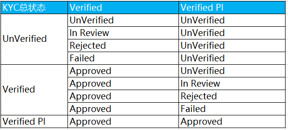

 **HashKey Xpert 产品需求文档** 

## 版本变更记录

| 序号 | 变更内容                                                     | 变更人 | 变更时间   |
| ---- | ------------------------------------------------------------ | ------ | ---------- |
| 1    | 新增Sprint1.0.0:   1、登录注册、忘记密码、修改密码、绑定/修改手机、修改邮箱 | 黄金叶 | 2022-03-14 |
| 2    | 新增Sprint1.1.0:   1、KYC认证；2、法币结算 | 黄金叶 | 2022-04-02 |
| 3    | 新增Sprint1.2.0:   1、钱包资产呈现；2、充值、提现、划转；3、交易记录 | 黄金叶 | 2022-04-18 |
<!-- TOC -->

    - [版本变更记录](#版本变更记录)

- [1.全局说明](#1-全局说明)
- [2.登录注册【1.0.0新增】](#22-登录100新增)
  - [2.1 注册【1.0.0新增】](#21-注册100新增)
  - [2.2 登录【1.0.0新增】](#22-登录100新增)
  - [2.3 忘记密码【1.0.0新增】](#23-忘记密码100新增)
  - [2.4 登出【1.0.0新增】](#24-登出100新增)
- [3.用户中心【1.0.0新增】](#3用户中心100新增)
  - [3.1安全设置【1.0.0新增】](#31-安全设置100新增)
  - [3.2KYC认证【1.1.0新增】](#32-kyc认证1100新增)
  - [3.3法币结算【1.1.0新增】](#33-法币结算1100新增)
- [4.钱包【1.2.0新增】](#4钱包120新增)
  - [4.1 资产呈现【1.2.0新增】](#41-资产呈现120新增)
  - [4.2 充值【1.2.0新增】](#42-充值120新增)
  - [4.3 提现【1.2.0新增】](#43-提现120新增)
  - [4.4 内部划转【1.2.0新增】](#44-内部划转120新增)
  - [4.5 交易记录【1.2.0新增】](#45-交易记录120新增)

<!-- /TOC -->

# 1.全局说明

**切面切换保护：**

* 当程序切换到后台时，在预览状态下，所有页面要模糊保护处理
  * 仅对IOS系统。
  * 安卓需要禁止截屏抓取页面才可实现，目前APP需要支持截屏，所以暂不实现。

**全局错误提示样式及类型：**

UI设计稿待补充

**弹窗类型：**

| 编号 | 场景                                   | 提示类型 | 消息类型         | Duration |
| ---- | -------------------------------------- | -------- | ---------------- | -------- |
| 1    | 二次确认（确认）                       | Modal01  | Confirm          | -        |
| 2    | 二次确认（确认/取消）                  | Modal02  | Confirm/Cancel   | -        |
| 3    | 二次确认（操作1//操作2/取消）          | Modal03  | 操作1/操作2/取消 | -        |
| 4    | 带标题二次确认（操作1/操作2/取消）     | Modal04  | 操作1/操作2/取消 | -        |
| 5    | 带标题图标二次确认（操作1/操作2/取消） | Modal05  | 操作1/操作2/取消 | -        |
| 6    | 输入框校验 （输入框下方出现提示）      | input01  | -                | -        |

* 网络加载失败
  * 提示类型：Toast
  * 中文提示语：网络加载失败,请重试
  * 英文提示语：Failed to load,retry.
* 加载数据超时
  * 提示类型：Toast
  * 中文提示语：加载数据超时
  * 英文提示语：Loading timeout
* 内部服务器程序运行错误时
  * 提示类型：Toast
  * 中文提示语：服务暂时不可用，请稍后再试   
  * 英文提示语：Service is temporarily unavailable, please retry later   

**国家/地区选择（按照英文或拼音的A-Z排序）：**

* 国家/地区列表参照文件：document-->countries.jason
* 国家/地区选择为通用页面
* 国家/地区下拉列表统一从后端获取配置文件（除Jumio身份信息校验国家地区从Jumio后端获取）
  * 注册登录页面，手机号下拉选项，点击“区域码”一栏，则打开【国家/地区选择】页面
  * 支持按照关键字进行国家/地区模糊搜索，输入框中输入关键字时即搜索，输入关键字时默认文案“Search//搜索”消失，列表中需展示匹配的国家/地区及区域码
  * 点击列表中的某一个国家/地区，则表示选中该国家/地区，返回上一页需带入选中的国家/地区对应区域码选项
  * 点击【取消//Cancel】，则返回上一页

  * 提示类型：Toast 
    校验规则：提交的为受限地区（不支持的国家） 
    文提示语：根据最新监管政策要求，目前暂不支持向受限地区用户提供服务  
    英文提示语：In response to the latest regulatory policy requirements, the restricted territory is temporarily suspended.  

**重复登录校验**
* 一个账号只能同时在一个设备上进行登录，当账号在其他设备（Web或APP）上进行登录时，当前账号下线，点击进行任何操作时进行提示

* 下线通知弹窗
  * 标题：下线通知//Logoff Notice
  * 内容：您的账号已在其他设备进行登录，如非本人操作，账号已存在泄漏风险，请及时更改密码//Your account has been logged in on another device, if not operated by youself, your account is at risk of leakage, please change your password promptly
  * 按钮：退出//Log out
    * 点击则退出当前账号，返回首页
  * 按钮：重新登录//Relogin
    * 点击则进入登录页面

 

**手机系统功能**

* 【IOS】支持手机自动读取短信填入输入框

  

**相关域名链接：**

* 用户协议：待补充
* 隐私政策：待补充

**短信发送限制**

* 单个号码为每分钟一条，到达限制后，需提示“请求次数太多，请稍后再试//You have sent too many requests,Please try again later"
* 单个号码每天限制40条，到达限制后，需提示“发送已达当日上限//Daily limit reached”

**敏感信息展示**

* 手机掩码展示规则：显示开始2个字符，最后3个字符，中间部分数字固定显示4个“*”
* 邮箱掩码展示规则：显示开始3个字符，以及@之后的部分，中间固定显示4个“*”

 **上传图片说明**

* 按钮：“上传//Upload”。点击“上传”，下方弹出选择
    * 相机//Camera
    * 从相册选择//Choose from Albums
    * 按钮：取消//Cancel，点击后关闭弹出
   
* 用户点击“相机//Camera”，授权获取相机调用权限
    * 提示类型：系统弹窗  
    场景：第一次点击“相机//Camera"，授权权限  
    中文标题：允许“HashKey”获取相机权限  
    英文标题：Allow HashKey to access your camera.  
    中文提示语：确认允许“HashKey”获取相机，以便于扫码识别、实名认证使用等      
    英文提示语：Do you allow HashKey to access your camera to extract the QRcode or verify identity,etc.      
    立即打开//Enable now：获得权限。  
    不允许//Don't allow：点击后，关闭当前弹窗。  

   * 提示类型：系统弹窗  
    场景：点击“相机//Camera”按钮，授权权限已被关闭  
    中文标题：在系统“设置”->"隐私"->"相机“允许“HashKey”授权相机使用权限  
    英文标题：Allow HashKey to access your camera in "Settings"->"Privacy"->"Camera"   
    立即打开//Enable now：打开系统设置页面。  

* 用户点击“相册//Album”，授权获取相册调用权限

    * 提示类型：系统弹窗  
    场景：第一次点击“相册”按钮，授权权限  
    中文标题：“HashKey”想访问您的相册  
    英文标题：Allow HashKey to accesss your photos  
    中文提示语：确认允许“HashKey”访问读取您的照片，以便于扫码识别、实名认证使用等  
    英文提示语:Do you allow HashKey to accesss your photos to extract the QRcode or verify identity,etc.  
    立即打开//Enable now：获得权限。  
    不允许//Don't allow：点击后，关闭当前弹窗。  

    * 提示类型：系统弹窗  
    场景：点击“相册”按钮，授权权限已被关闭  
    中文标题：在系统“设置”->"隐私"->"相册“允许“HashKey”授权照片访问权限  
    英文标题：Allow HashKey to access your camera in "Settings"->"Privacy"->"photos"   
    立即打开//Enable now：打开系统设置页面。 
    
    
* 校验以下场景：  
      
    * 场景1：证件格式正确但体积过大,在上传时提示      
          提示类型：toast    
          中文提示语：文件上传最大不超过10M    
          英文提示语：Upload image within 10M.     
      
    * 场景2：必填项证件格式错误，点击提交验证   
          提示类型：toast
          中文提示语：请以jpg、png格式上传   
          英文提示语：Upload image in jpg or png format.     

    * 场景3：上传图片失败，在上传时提示
          提示类型：固定显示在图片上    
          中文提示语：上传失败  
          英文提示语：Upload failed    
          备注：不支持点击，放大预览图片

* 点击上传的图片，全屏放大预览，再次点击关闭全屏。(1.0暂不支持)

 **扫一扫说明**

* 前置条件
  * 用户提现点击“扫一扫”
  * 用户新增地址点击“扫一扫”

* 页面元素
  * 标题：扫一扫//Scan
  * 按钮：相册//Album
  * 提示文案：请将二维码放入扫描框内//Please put the QRcode into the scanning box

* 交互逻辑

  * 用户点击“扫一扫”，授权获取相机调用权限

    * 提示类型：系统弹窗  
    场景：第一次点击“扫一扫”按钮，授权权限  
    中文标题：允许“HashKey”获取相机权限  
    英文标题：Allow HashKey to access your camera.  
    中文提示语：确认允许“HashKey”获取相机，以便于扫码识别、实名认证使用等      
    英文提示语：Do you allow HashKey to access your camera to extract the QRcode or verify identity,etc.      
    立即打开//Enable now：获得权限。  
    不允许//Don't allow：点击后，关闭当前弹窗。  

    * 提示类型：系统弹窗  
    场景：点击“扫一扫”按钮，授权权限已被关闭  
    中文标题：在系统“设置”->"隐私"->"相机“允许“HashKey”授权相机使用权限  
    英文标题：Allow HashKey to access your camera in "Settings"->"Privacy"->"Camera"   
    立即打开//Enable now：打开系统设置页面。  

  * 用户点击“相册//Album”，授权获取相册调用权限。

    * 提示类型：系统弹窗  
    场景：第一次点击“相册”按钮，授权权限  
    中文标题：“HashKey”想访问您的相册  
    英文标题：Allow HashKey to accesss your photos  
    中文提示语：确认允许“HashKey”访问读取您的照片，以便于扫码识别、实名认证使用等  
    英文提示语:Do you allow HashKey to accesss your photos to extract the QRcode or verify identity,etc.  
    立即打开//Enable now：获得权限。  
    不允许//Don't allow：点击后，关闭当前弹窗。  

    * 提示类型：系统弹窗  
    场景：点击“相册”按钮，授权权限已被关闭  
    中文标题：在系统“设置”->"隐私"->"相册“允许“HashKey”授权照片访问权限  
    英文标题：Allow HashKey to access your camera in "Settings"->"Privacy"->"photos"   
    立即打开//Enable now：打开系统设置页面。  
* 后置说明
  * 扫一扫未识别出地址二维码，则Toast提示“无法识别二维码//Failed to read QR code”
  * 地址二维码成功识别后，返回上一页，并将识别到的地址带入对应的输入框中

 **支持币种**
  * 当前支持充提的币种链接：https://shimo.im/sheets/m5kv9XvKMlC4RqX0/BMkwJ
    * 参照UserHotWallet BCTSHotWallet-Coins(Support Now)部分

# 2.登录注册【1.0.0新增】

## 2.1 注册【1.0.0新增】

### 2.1.1 功能概述

为实现HashKey用户在一次注册后能够使用HashKey各业务线的产品和服务，提升用户体验、优化开发资源，需要将Xpert、Hub、Bcts进行账户整合，打造全新的APP

### 2.1.2 业务流程

注册流程：

1. 进入注册页面
2. 填写手机或邮箱 
3. 人机验证
4. 帐户(邮箱、手机号)唯一性、格式校验
5. 调用第三方发送验证码
6. 填写验证码，验证注册账号
7. 验证码为空校验、时效性校验、正确校验
8. 设置密码
9. 密码为空校验、格式校验、复杂度校验
10. 注册成功
11. 绑定Google认证
12. 自动登录，进入首页

### 2.1.3 UI设计稿

原型链接：[https://modao.cc/app/iXralQe8r7qyr5vnldcmkw 《Xpert》](https://modao.cc/app/iXralQe8r7qyr5vnldcmkw 《Xpert》) 

UI链接：https://lanhuapp.com/web/#/item/project/stage?tid=e44db160-5031-4fb1-a111-760af024f228&pid=58a1b682-293a-4980-a789-9dc5b2e16749

### 2.1.4 需求详述

**前置条件**

* 通过页面点击或者跳转进入注册页面

**交互逻辑**

* 【创建账户//Create account】
  * 点击“区域码”一栏，打开【国家/地区选择】页面
  * 手机或邮箱填写完成后，点击”下一步//Next“，先进行人机验证，通过后再进行格式校验，最后判断填写的手机或邮箱是否注册成功，若已注册成功，需提示“手机号码已存在//Phone number already exists"，“邮箱已存在//Email already exists”
  * 点击“登录//Login in”，进入到登录页面
  * 点击“User Agreement, Privacy Policy ”，进入协议查看页面，点击“关闭”按钮，关闭当前页面
* 人机校验及其他校验通过后，进入【手机/邮箱认证//Verify phone/Email】页面，验证成功后，点击”下一步Next“，进入【设置密码//Create a password】页面
* 【设置密码//Create a password】，设置成功后，点击“提交//Submit"，注册成功，自动跳转至首页，弹窗提示绑定GA，确认后进入【谷歌认证//Google Authentication】页面
* 【谷歌认证Google Authentication】，验证成功后，点击“提交//Submit"，返回首页

**页面元素**

【创建账户//Create account】 

* 用户名默认为用户注册账号，手机号或邮箱
* 展示文案1：已有账号，登录//Already have an account? Log in
* 展示文案2：注册账号代表您同意了HashKey的用户协议、隐私政策//By create an account, I agree with HashKey User Agreement,Privacy Policy

* 选择区域码
  * 根据IP填入区域码，若用户IP不在支持的国家/列表中，则默认填充中国香港的区号（+852）。
  * 点击区域码，打开【国家/地区选择】页面
  * 对应区域码参看全局说明“国家/地区选择”章节。

* 手机//Phone：默认显示“请输入您的手机号//Enter phone number”，限制最多输入11位数字字符长度。

  * 提示类型：Toast    
    场景：校验手机号格式，仅为数字         
    中文提示语：手机号格式错误      
    英文提示语：Invalid phone number 
    备注：点击“下一步”校验   

* 邮箱//Email：默认提示“请输入您的邮箱//Enter email”，限制最多输入50个字符。

  * 提示类型：Toast  
    场景：邮箱格式不正确 
    校验原则：以“@”符号及“.xx”作为格式校验依据       
    中文提示语：邮箱格式不正确    
    英文提示语：Invalid Email address  
    备注：点击“下一步”校验  
   

* 手机号或邮箱，“下一步"按钮默认为置灰不可点击，填写后，变为高亮可点击状态，点击“下一步”必填项校验成功后，弹出滑动人机验证，验证成功后，发送验证码。

【人机校验】

* 安全验证//Account Security
  * 人机安全验证//Anti-Bot Detection 

  * 提示类型：由人机验证控件决定      
    校验规则：由人机验证进行操作判断  
    备注1：默认首先开启无感验证，发现有风险后，才升级验证方式（比如滑块等）    

         中文          |             英文             
        ---------------------- | ---------------------------- 
        拖动下方的滑块         | Drag the slider below        
        加载失败，请重试       | Loading error, please retry  
        加载中...              | Loading...                   
        无感验证成功           | Success                           
        请向右拖动滑块完成验证 | Drag the slider to the right 
        智能检测中             | Detecting                    
        验证成功               | Success                      
        验证失败               | Verify Error    
        验证失败，请重试        | Verify Error, please retry               
        验证中                 | Verifying                    

【手机/邮箱认证//Verify phone/Email】
* 手机时标题显示“验证手机//Verify Phone”，邮箱时标题显示“验证邮箱//Verify Email”
* 手机认证文案
  * 中文文案展示：输入发送至手机18****107的6位验证码
  * 英文文案展示：Enter the 6-digit code sent to 18****107
* 邮箱认证文案
  * 中文文案展示：输入发送至邮箱12****@163.com的6位验证码
  * 英文文案展示：Enter the 6-digit code sent to 12****@163.com
  * 手机及邮箱需脱敏

* 按钮“发送验证码//Send”，用户点击“发送验证码//Send”按钮在发送成功后将显示为“60s”，可再点击“重新发送//Resend。
* 输入6位后，按钮“下一步//Next”由置灰状态变为高亮可点击状态，点击后，校验通过，则进入下一个页面

* 
  * 提示类型：Toast  
    校验规则：发送验证码24小时超过发送限制（IP/手机号）    
    中文提示语：发送已达当日上限   
    英文提示语：Daily limit reached
  * 提示类型：Toast  
    校验规则：发送验证码频率，24小时最多发送100次 （邮箱）   
    中文提示语：邮箱验证码发送次数已达上限    
    英文提示语：Email verification has reached the upper limit
  * 提示类型：Toast  
    场景：发送短信与上次短信成功发送的时间间隔未大于60秒  
    校验原则：再次发送短信与上次短信成功发送的时间需要大于60秒  
    中文提示语：请求次数太多，请稍后再试         
    英文提示语：You have sent too many requests, please try again later     
  * 提示类型：Toast  
    场景：发送邮件与上次邮件成功发送的时间间隔未大于60秒  
    校验原则：再次发送邮件与上次邮件成功发送的时间需要大于60秒  
    中文提示语：请求次数太多，请稍后再试         
    英文提示语：You have sent too many requests,please try again later 
  * 提示类型：Toast    
    场景：发送短信功能异常  
    校验原则：发送短信功能异常  
    中文提示语：发送短信失败，请重试  
    英文提示语：Send sms error, please retry     
    备注：点击人机验证通过后，产生的发送失败 
  * 提示类型：Toast    
    场景：验证短信发送成功    
    校验原则：电话区号与手机号码输入正确且验证短信发送成功  
    中文提示语：短信发送成功  
    英文提示语：Success   
  * 提示类型：Toast    
    场景：验证邮箱发送成功    
    校验原则：邮箱输入正确且验证邮箱发送成功  
    中文提示语：邮件发送成功  
    英文提示语：Success    
  * 提示类型：Toast    
    场景：人机验证失败    
    校验原则：获取的token与后端检验不一致  
    中文提示语：验证失败，请稍后再试  
    英文提示语：Authentication failed, please retry   

* 仅支持输入6位的验证码，自动校验，验证码状态：有效、失效、过期。校验与提示如下：

  * 提示类型：Toast    
    场景：未点击发送按钮获取验证码       
    校验原则：未点击发送按钮获取验证码    
    中文提示语：请发送验证码     
    英文提示语：Please send code        

  * 提示类型：Toast   
    场景：验证码输入校验错误  
    校验原则：验证码正确性    
    中文提示语：验证码错误  
    英文提示语：Incorrect code      
    备注：容许9次错误，第10次开始需要重新发送

  * 提示类型：Toast  
    场景：存在填写的验证码格式不正确    
    校验原则：验证码只能为6位整数    
    中文提示语：不符合格式要求   
    英文提示语：Invalid format     
    备注：点击“确认登录” 提交验证   

  * 提示类型：Toast   
    场景：验证码输入校验错误9次，第10次开始做失效处理  
    校验原则：验证码正确性和有效性，且为6位整数，    
    中文提示语：验证码错误多次，请重发  
    英文提示语：Incorrect code, please get a new one     
    备注：验证码做失效处理。

  * 提示类型：Toast   
    场景：验证码已输入6位数字，但验证码过期。或成功后得验证码失效处理。     
    校验原则：验证码不能过期  
    中文提示语：验证码过期，请重发    
    英文提示语：Code expired, please get a new one       
    备注：短信10分钟过期，邮件60分钟过期   

【设置密码//Create a password】

* 密码//Password
  * 输入框提示：请输入密码//Enter the password
  * 逻辑限制：输入限制长度8-30位字符
* 提示语：8-30位字符/8-30 characters   
  * 如新密码输入框有值，但输入不符合描述标准，显示红字

* 隐藏眼睛：支持密码的明文隐藏与显示切换，默认第一次输入默认隐藏。
* 按钮：提交//Submit，默认置灰不可点击，必填项都填写之后，变为高亮可点击状态

* 完成注册：所有验证通过，完成注册，跳转至首页，弹窗提示绑定GA
  *  提示类型： Modal02  
    场景：用户注册成功并跳转至首页，默认登录状态，弹窗提示注册成功，并引导绑定GA
     标题：重要提示//Important Notice
     提示文案：注册成功，为了您的账号安全，请立马绑定谷歌验证//Registered successfully,for the security of your account, please bind Google verification immediately

     按钮：立即绑定//Start，点击则进入【谷歌认证//Google Authentication】页面

     按钮：稍后再说//Not now，点击则关闭弹窗，停留在首页
     

【谷歌认证//Google Authentication】

* 分三个页面进行展示，页面标题：谷歌认证//Google Authentication

* 1、下载谷歌验证器
  * 展示文案：请在您的设备上下载谷歌验证器//Please install Google Authenticator App on your device 
  * 按钮：下载完成，下一步//I've downloaded, Next

* 2、绑定谷歌验证器并保持密钥
  * 展示文案：
    *  创建//Create 
    * 打开谷歌验证器，点击"+"，选择"输入设备密钥"，并输入您的HashKey账户名和下方密码，以取得验证码//Open the Google Authenticator, tap"+", select "Enter a setup key" and enter your HashKey account name and the below key manually to get the code
    * 谷歌验证码
    * 复制按钮，点击可进行复制

    * 保存//Save
    * 将密钥匙记录在纸上，如遇手机遗失，您可以通过该密钥恢复您的谷歌验证//Save this key on paper. This key will allow you to recover your Google Authenticator in case of phone loss.
    

  * 按钮：已保存，下一步//I've saved, Next
  * 如何绑定GA，更多细节请点击这里//How to blind GA, more detailed approach click to check>> 
  * 如何绑定谷歌认证，点击后页面打开H5的FAQ的相关文章页面，
    * 简体链接：待补充
    * 英文链接：待补充
    * 繁体链接：待补充

* 3、输入验证码
  * 展示文案：添加成功后，您将得到一组验证码，请填入下方//Enter the code generated by the Google Authenticator app in the field below

  * 谷歌验证码//Google Authenticator
    * 输入框提示：输入验证码// Enter Code
    * 输入限制：限制只能输入6位数字

  * 按钮：提交//Submit，默认置灰不可点击，必填项都填写之后，变为高亮可点击状态

   * 点击“提交//Submit”按钮

      * 验证码校验规则参照【登录/Login】-2FA校验-验证码校验规则，不再复述     
        
   * 绑定谷歌认证结果：

     * 场景1：成功绑定谷歌认证    
       提示类型：Toast  
       中文提示语：谷歌认证成功     
       英文提示语：Activated      
       备注：成功跳转至首页

     * 场景2：谷歌认证失败    
       提示类型：Toast    
       中文提示语：谷歌认证失败            
       英文提示语：Activation Failed       
       备注：停留在当前页面，并清除已输入验证码     

## 2.2 登录【1.0.0新增】

###  2.2.1 功能概述

注册成功后的用户，可以正常登录Xpert APP，并可以访问对应的功能

### 2.2.2 业务流程

登录流程：

1. 填写手机号或邮箱
2. 填写密码
3. 人机校验
4. 新设备校验
5. 帐户和密码格式校验、输错校验
6. 2FA校验
7. 验证码为空校验、时效性校验、正确校验
8. 登录成功
9. 绑定GA校验
10. 未绑定则弹窗进行提示，如需要绑定进入【谷歌认证Google Authentication】，已绑定则进入首页

### 2.2.3 UI设计稿

原型链接：[https://modao.cc/app/iXralQe8r7qyr5vnldcmkw 《Xpert》](https://modao.cc/app/iXralQe8r7qyr5vnldcmkw 《Xpert》) 

UI链接：https://lanhuapp.com/web/#/item/project/stage?tid=e44db160-5031-4fb1-a111-760af024f228&pid=58a1b682-293a-4980-a789-9dc5b2e16749

### 2.2.4 需求详述

**前置条件**

* 用户已注册成功

**交互逻辑**

- 【登录//Log in】
  - 点击”登录//Log in“，先进行人机校验，通过后，再进行格式及正确性校验，通过后，进入到【谷歌验证//Google Auth】页面
  - 点击”忘记密码//Forget password“，进入到【重设密码//Reset Password】页面
- 【谷歌验证//Google Auth】
  - 点击”提交//Submit“，校验成功后，登录成功
  - 点击“手机验证//Phone Auth",进入到【手机验证//Phone Auth】页面
  - 点击“邮箱验证//Email Auth”，进入到【邮箱验证//Email Auth】页面
  - 若用户绑定了手机未绑定邮箱，则左下角文案显示“切换至手机验证//Switch to Phone Auth";若用户绑定了邮箱未绑定手机，则左下角文案显示”切换至邮箱验证//Switch to Email Auth"；若用户手机及邮箱都绑定，按照手机>邮箱优先级进行展示
- 【手机验证//Phone Auth】
  - 点击”发送//Send",发送验证码，显示倒数60s，结束后，按钮变为“重新发送//Resend"
  - 点击”提交//Submit“，校验成功后，登录成功
  - 点击“谷歌验证//Google Auth”，进入到【谷歌验证//Google Auth】页面
- 【邮箱验证//Email Auth】
 - 点击”发送//Send",发送验证码，显示倒数60s，结束后，按钮变为“重新发送//Resend"
 - 点击”提交//Submit“，校验成功后，登录成功
 - 点击“谷歌验证//Google Auth”，进入到【谷歌验证//Google Auth】页面
- 登录成功后，需判断用户是否已绑定GA，若未绑定，则弹窗提示进行绑定；若已绑定，则直接进入首页

**页面元素**

【登录//Log in】
* 展示文案：还未有账号？注册//Don't have an accout? Sign up

* 选择区域码
  * 根据IP填入区域码，若用户IP不在支持的国家/列表中，则默认填充中国香港的区号（+852）。
  * 点击区域码，打开【国家/地区选择】页面
  * 对应区域码参看全局说明“国家/地区选择”章节。

* 手机//Phone：默认显示“请输入您的手机号//Enter phone number”，限制最多输入11位数字字符长度。

  * 提示类型：Toast    
    场景：校验手机号格式，仅为数字         
    中文提示语：手机号格式错误      
    英文提示语：Invalid phone number    

* 邮箱//Email：默认提示“请输入您的邮箱//Enter email”，限制最多输入50个字符。

  * 提示类型：Toast  
    场景：邮箱格式不正确 
    校验原则：以“@”符号及“.xx”作为格式校验依据       
    中文提示语：邮箱格式不正确    
    英文提示语：Invalid Email address  
    备注：失焦校验   

 * 登录密码//Login Password：限制最大可输入长度30个字符，默认提示“请输入密码//Enter the password”密码输入默认隐藏(点击后，图标点亮，明文显示)。校验规则如下，如校验不通过，进行提示。

   * 提示类型：Input01  
     场景：密码不符合规范  
     校验原则：8-30位，不能为空  
     中文提示语：8-30位字符    
     英文提示语：8-30 characters  
     备注：失焦或点击登录按钮校验   

* 登录：账号密码输入为空，登录按钮灰化无法点击。点击“登录”后，除上述校验规则与提示外，其他校验及提示方式如下。

  * 提示类型：Toast    
    场景：用户登录成功  
    校验原则：所有验证正确     
    备注：登录校验通过后，进入到2FA认证页面 
  * 提示类型：Toast  
    场景：账号密码不匹配  
    校验原则：账号不存在，或账号与密码不匹配  
    中文提示语：帐号或密码不正确   
    英文提示语：User name or password is incorrect 
  * 提示类型：Toast  
    场景：登录超时,登录态保持3天  
    校验原则：登录时间超过3天  
    中文提示语：登录超时  
    英文提示语：Login session expired  
    备注：以每次输入帐户和密码的登录后开始计算 

2FA校验

* 谷歌认证//Google Auth
  * 文案展示：输入6位谷歌验证码//Enter the 6-digit code from Authenticator
  * 点击“粘贴//Paste”，自动将复制好的内容粘贴至验证码输入框
  * 若用户绑定了手机未绑定邮箱，则左下角文案显示“切换至手机验证//Switch to Phone Auth";若用户绑定了邮箱未绑定手机，则左下角文案显示”切换至邮箱验证//Switch to Email Auth"；若用户手机及邮箱都绑定，按照手机>邮箱优先级进行展示
  *点击“手机认证//Phone Auth",进入到【手机认证//Phone Auth】页面
  *点击“邮箱认证//Email Auth"，进入到【邮箱认证//Email Auth】页面
* 手机认证//Phone Auth
  * 中文文案展示：输入发送至手机18****107的6位验证码
  * 英文文案展示：Enter the 6-digit code sent to 18****107
  * 点击“发送//Send"，后端调用服务商发送验证码短信至用户绑定的手机号，显示倒数60s，结束后，按钮变为“重新发送//Resend” 
  * 点击"谷歌认证//Google Auth",进入到【谷歌认证//Google Auth】页面
* 邮箱认证//Email Auth
  * 中文文案展示：输入发送至邮箱12****@163.com的6位验证码
  * 英文文案展示：Enter the 6-digit code sent to 12****@163.com
  * 点击“发送//Send"，后端调用服务商发送验证码短信至用户绑定的手机号，显示倒数60s，结束后，按钮变为“重新发送//Resend” 
  *  点击"谷歌认证//Google Auth",进入到【谷歌认证//Google Auth】页面
* 点击“提交//Submit"，仅支持数字输入，校验规则如下：
  * 提示类型：Toast    
    场景：用户登录成功  
    校验原则：所有验证正确  
    中文提示语：登录成功   
    英文提示语：Logged in    
    备注：登录校验通过后，判定是否已绑定GA  
  * 若为新设备登录判断，如果发现用户是以往设备中的新设备（不包括第一次），则需要发送异常登陆邮件/短信提醒至用户对于邮箱和手机
* 【验证码校验规则】
  * 按钮：“提交//Submit”，默认置灰不可点击，必填项都填写之后，变为高亮可点击状态  
  * 提示类型：Toast  
    场景：存在填写的验证码格式不正确    
    校验原则：验证码只能为6位整数    
    中文提示语：不符合格式要求   
    英文提示语：Invalid format     
    备注：点击“提交//Submit"提交验证     
  * 提示类型：Toast   
    场景：验证码输入校验错误  
    校验原则：验证码正确性    
    中文提示语：验证码错误  
    英文提示语：Incorrect code      
    备注：容许9次错误，10次输对机会，谷歌验证例外
  * 提示类型：Toast   
    场景：验证码输入校验错误9次，第10次开始做失效处理  
    校验原则：验证码正确性和有效性，且为6位整数        
    中文提示语：验证码错误多次，请重发  
    英文提示语：Incorrect code, please get a new one     
    备注：验证码做失效处理。
  * 提示类型：Toast   
    场景：验证码已输入6位数字，但验证码过期。或成功后得验证码失效处理。     
    校验原则：验证码不能过期  
    中文提示语：验证码过期，请重发    
    英文提示语：Code expired, please get a new one       
    备注：短信10分钟过期，邮件60分钟过期，谷歌按照谷歌过期时间
* 【绑定GA弹窗】
  * 标题：温馨提示//Tips
    正文：为给您提供持续稳定的服务，建议您绑定谷歌验证。//To provide you with better services, please bind Google Authentication to your account.
    按钮：立即绑定//Set Up
    点击，进入谷歌验证页面

**其他说明：**

* 异常IP登录，邮件或短信提醒，具体查看短信邮件模版（暂不实现）

  

## 2.3 忘记密码【1.0.0新增】

### 2.3.1 功能概述

用户在忘记密码的情况下，需要提供重置密码功能

### 2.3.2 业务流程

忘记密码流程：

1. 点击“忘记密码”
2. 进入重置密码页面
3. 填写手机号或邮箱
4. 人机验证，调用第三方服务发送验证码
5. 填写验证码
6. 重新设置密码，并进行二次确认
7. 完成修改，进入登录页面，重新进行登录

### 2.3.3 UI设计稿

原型链接：[https://modao.cc/app/iXralQe8r7qyr5vnldcmkw 《Xpert》](https://modao.cc/app/iXralQe8r7qyr5vnldcmkw 《Xpert》) 

UI链接：https://lanhuapp.com/web/#/item/project/stage?tid=e44db160-5031-4fb1-a111-760af024f228&pid=58a1b682-293a-4980-a789-9dc5b2e16749

### 2.3.4 需求详述

**前置条件**

* 登录页面，点击“忘记密码”。

**交互逻辑**

* 【忘记密码//Forget password】
  * 点击”下一步//Next“，先进行人机校验，通过后，再校验填写的手机或邮箱需是否注册成功，若未注册成功，需提示“用户不存在//User no exists”
* 上一步校验都通过后，进入【手机/邮箱认证//Verify phone/Email】页面，验证成功后，点击”下一步Next“，进入【重置密码//Reset password】页面
* 【重置密码//Reset password】，设置成功后，点击“确认//Confim"，进入到登录页面

**页面元素**

【忘记密码//Forget password】

* 展示文案：登录密码修改后，转账功能将被禁止24小时。//The transfer function will be disabled for 24 hours after login password has been changed.
* 校验规则同注册模块2.1.4【创建账户//Create account】 ，不再复述

【手机/邮箱认证//Verify phone/Email】

* 同注册模块2.1.4【创建账户//Create account】 ，不再复述

【重置密码//Reset password】

* 新密码//New password
  * 请输入密码//Enter the password
* 确认密码//Confirm
  * 再次确认密码//Confirm the password
* 密码本身的校验规则:同“注册密码设置”的校验，补充校验如下：
  * 提示类型：Toast  
    场景：密码与确认密码不一致  
    校验原则：密码与第一次输入保持一致  
    中文提示语：请保持密码一致  
    英文提示语：Enter the same password    
    备注：点击“提交”按钮 
* 校验通过后，完成设置，进入登录页面。

## 2.4 登出【1.0.0新增】

### 2.4.1 需求详述

**前置条件**

- 用户已成功登录

**交互逻辑**

- 用户进入【我的//Me】页面，点击“Log out",弹窗确认，确认后成功登出

**页面元素**

- 【确认登出弹窗】
  - 提示类型：Modal02
  - 提示语：确认要退出登录？//Are you sure you want to log out?
  - 确认//Confirm：进行登出，成功后到登录页面。
  - 关闭//Close：点击后，关闭当前弹窗。

# 3.用户中心【1.0.0新增】
 **个人信息**

 默认头像，暂不可修改

 账户名：取用户注册的邮箱或手机，掩码展示，即用户用手机注册，则展示注册的手机号，若手机号后续进行了更改，则展示更新的手机号；若用户用邮箱注册，则展示注册的邮箱，若邮箱后续进行了更改，则展示更新的邮箱

 角色：用户个人认证总状态为Verified或Verified PI时，展示个人用户icon;用户机构认证总状态为Verified或Verified PI时，展示机构用户icon

 用户ID：UID,明码展示用户ID，点击复制icon，复制到粘贴板，并toast提示“复制成功//Copy success”

## 3.1 安全设置【1.0.0新增】

### 3.1.1 功能概述

为保障用户账号安全，一期需实现用户登录密码修改、绑定邮箱、绑定/修改手机功能

### 3.1.2 UI设计稿

待补充

### 3.1.3 需求详述

【安全设置//Security Settings】

* 页面元素：
  * 标题：安全设置//Security Settings
    * 提示文案1：密码//Password
    * 提示文案2：多因素认证//Multi-Factor Authentication

    * 登录密码//Login Password
      * 修改//Edit

    * 谷歌认证//Google Authentication
      * 未设置//Disabled
      * 修改//Edit（一期暂不实现）
    * 手机认证//Mobile Authentication
      * 未设置//Disabled
      * 修改//Edit
      * 若已绑定手机，则掩码展示最新的手机号
    * 邮件认证//Email Authentication
      * 未设置//Disabled
      * 修改//Edit
      * 若已绑定邮箱，则掩码展示最新的邮箱
  * 点击左上角“返回//Back”，返回上一页。

#### 3.1.3.1 修改登录密码

**前置条件**

* 用户登录状态
* 点击安全设置的修改密码

**页面元素**

* 标题：修改密码//Change Password
* 展示文案：登录密码修改后，转账功能将被禁止24小时。//The transfer function will be disabled for 24 hours after login password has been changed.
* 旧密码//Original password 
  * 输入框提示：请输入旧密码//Enter the original password
  * 逻辑限制：限制最大可输入长度30个字符
* 新密码//New password
  * 输入框提示：请输入新密码//Enter the new password
  * 逻辑限制：限制最大可输入长度30个字符
* 密码提示语：8-30位字符//8-30 characters
  * 如新密码输入框有值，但输入不符合描述标准，显示红字
* 确认密码//Confirm new password
  * 输入框提示：请输入新密码//Repeat new password
  * 逻辑限制：限制最大可输入长度30个字符
* 2FA校验
  * 按照校验顺序：GA>手机>邮箱，若其中一个未绑定则按照优先顺序显示下一个
  * 谷歌认证//Google verification
     * 输入框提示：输入谷歌验证码//Enter GA code
     * 点击“粘贴//Paste”，自动将复制好的内容粘贴至验证码输入框， 非数字6位，则提示（Toast）“不符合格式要求//Invalid format”，为空则提示（Toast）“剪贴板没有内容//Clipboard is blank”
  * 手机认证//Phone verification
     * 输入框提示：输入手机验证码//Enter Phone code
     * 点击“发送//Send"，后端调用服务商发送验证码短信至用户绑定的手机号， toast提示“我们已发送验证码至手机18****123//

       we sent a code to 18****123"，并显示倒数60s，结束后，按钮变为“重新发送//Resend” 
  * 邮箱认证//Email verification
     * 输入框提示：输入邮箱验证码//Enter Email code
     * 点击“发送//Send"，后端调用服务商发送验证码短信至用户绑定的邮箱， toast提示“我们已发送验证码至邮箱183****@163.com//

       we sent a code to 183****@163.com"，并显示倒数60s，结束后，按钮变为“重新发送//Resend” 

* 隐藏眼睛：密码全部密文显示，点击右侧“眼睛图标”(点击后，图标点亮）显示明文

* 按钮：确认//Confirm，默认置灰不可点击，必填项都填写之后，变为高亮可点击状态

* 点击“确认//Confirm”，依次校验如下规则，如校验不通过，进行提示

    
  * 提示类型：Toast   
    场景：旧密码输错  
    校验原则：旧密码输错     
    中文提示语：原密码不正确      
    英文提示语：Password is incorrect   
    

  * 提示类型：Toast 
    场景：新密码格式不符合要求   
    校验原则：8-30位字符   
    中文提示语：8-30位字符   
    英文提示语：8-20 characters  
 
    

  * 提示类型：Toast     
    场景：新密码与原密码相同  
    校验原则：新密码与历史所有设置过的原密码相同       
    中文提示语：新密码不能和旧密码相同       
    英文提示语：The new password can not be the same as the original one   
   

  * 提示类型：Toast  
    场景：确认密码与新密码不一致  
    校验原则：确认密码需与新密码输入保持一致  
    中文提示语：请保持密码一致  
    英文提示语：Enter the same password    
    

  * 验证码校验参照【登录/Login】-2FA校验-验证码校验规则，不再复述

* 校验通过后：

  * 场景1：成功修改密码  
    提示类型：Toast  
    中文提示语：修改成功    
    英文提示语：Updated Success      
    备注：登出帐户，跳转登录页面重新登录  

  * 场景2：修改密码失败    
    提示类型：Toast  
    中文提示语：修改失败     
    英文提示语：Updated Failed    
    备注： 保留之前的填写密码，页面不跳转     

**其他说明**

* 跳转登录页面重新登录

#### 3.1.3.2 绑定/修改手机认证

**前置条件**

* 用户登录状态
* 点击安全中心的绑定手机认证

**页面元素**

**【绑定手机】**
* 标题：绑定手机//Bind Phone number 
* 区域码
  * 根据IP填入区域码，若用户IP不在支持的国家/列表中，则默认填充中国香港的区号（+852）。
  * 点击区域码，打开【国家/地区选择】页面
  * 对应区域码参看全局说明“国家/地区选择”章节。
 
 * 手机//Phone
   * 输入框提示：请输入您的手机号//Enter your phone number
   * 限制最多输入11位数字字符长度。
 * 按钮：发送//Send
   * 点击发送后显示（60秒内）：60s
   * 点击发送后显示（大于60秒）：重新发送//Resend

 * 手机验证//Phone verification
   * 输入框提示：手机验证码//Enter phone verification code
   * 输入限制：限制只能输入6位数字
 * 粘贴//Paste 
   * 点击后粘贴复制的验证码，非数字6位，则提示（Toast）“不符合格式要求//Invalid format”，为空则提示（Toast）“剪贴板没有内容//Clipboard is blank”。
  
* 2FA校验
  * 参照【3.1.3.1 修改登录密码】2FA校验说明，不再复述

 * 按钮：确认//Confirm，默认置灰不可点击，必填项都填写之后，变为高亮可点击状态

* 点击“确认//Confirm”

  * 手机验证及2FA校验，验证码校验参照【登录/Login】-2FA校验-验证码校验规则，不再复述 

* 安全认证校验通过后：

  * 场景1：成功绑定手机认证    
    提示类型：Toast    
    中文提示语：手机认证成功          
    英文提示语：Verified       
    备注：成功跳转安全中心  

  * 场景2：绑定手机认证失败      
    提示类型：Toast     
    中文提示语：手机认证失败         
    英文提示语：Verification Failed           
    备注：停留在当前页面

**【修改手机】**
* 标题：修改手机//Change Phone Number

* 展示文案    
  * 手机号修改后，转账功能将被禁止24小时。//Transfer function will be disabled for 24 hours after phone number has been changed.

* 选择区域码
  * 根据IP填入区域码，若用户IP不在支持的国家/列表中，则默认填充中国香港的区号（+852）。
  * 点击区域码，打开【国家/地区选择】页面
  * 对应区域码参看全局说明“国家/地区选择”章节。
  
* 新手机// New phone
   * 输入框提示：请输入您的手机号//Enter your new phone number
   * 限制最多输入11位数字字符长度。
 * 按钮：发送//Send
   * 点击发送后显示（60秒内）：60s
   * 点击发送后显示（大于60秒）：重新发送//Resend

 * 新手机认证//New phone verification
   * 输入框提示：新手机短信验证码//Enter new phone verification code
   * 输入限制：限制只能输入6位数字
 * 粘贴//Paste 
   * 点击后粘贴复制的验证码，非数字6位，则提示（Toast）“不符合格式要求//Invalid format”，为空则提示（Toast）“剪贴板没有内容//Clipboard is blank”

* 2FA校验
  * 参照【3.1.3.1 修改登录密码】2FA校验说明，不再复述

 * 按钮：确认//Confirm，默认置灰不可点击，必填项都填写之后，变为高亮可点击状态

* 点击“确认//Confirm”
   * 提示类型：Toast

     场景：手机是否重复校验

     校验原则：新手机不能与原手机一样       
    中文提示语：新手机不能与原手机一样   
    英文提示语：The new phone cannot be the same as the original phone
  * 新手机验证及2FA校验，验证码校验参照【登录/Login】-2FA校验-验证码校验规则，不再复述

* 安全认证校验通过后：

  * 场景1：成功修改手机    
    提示类型：Toast    
    中文提示语：手机修改成功          
    英文提示语：Updated Success       
    备注：成功跳转安全中心     

  * 场景2：修改手机失败      
    提示类型：Toast     
    中文提示语：手机修改失败         
    英文提示语：Updated Failed           
    备注：停留在当前页面

**其他说明**

* 手机绑定或修改成功，跳转至安全设置页面，手机认证显示”编辑//Edit",并掩码展示最新的手机号，可修改
* 修改手机认证，发邮件或短信提醒用户，具体查看短信邮件模版

#### 3.1.3.1 绑定/修改邮箱认证

**前置条件**

* 用户登录状态
* 点击安全中心的绑定邮箱认证

**页面元素**

**【绑定邮箱】**

* 标题：绑定邮箱//Bind Email
  
* 邮箱//Email
  * 输入框提示：请输入您的邮箱//Enter your email
  * 逻辑限制：限制最多输入50个字符。
* 按钮：发送//Send
  * 点击发送后显示（60秒内）：60s
  * 点击发送后显示（大于60秒）：重新发送//Resend

* 邮箱验证码/Email Verification
  * 输入框提示：邮箱验证码//Enter email verification code
  * 输入限制：限制只能输入6位数字

* 按钮：粘贴//Paste 
  * 点击后粘贴复制的验证码，非数字6位，则提示（Toast）“不符合格式要求//Invalid format”，为空则提示（Toast）“剪贴板没有内容//Clipboard is blank”

* 2FA校验
  * 参照【3.1.3.1 修改登录密码】2FA校验说明，不再复述

* 按钮：确认//Confirm，默认置灰不可点击，必填项都填写之后，变为高亮可点击状态

* 点击“确认//Confirm”后，依次校验如下规则：   
  * 提示类型：Toast  
    场景：邮箱格式不正确 
    校验原则：以“@”符号及“.xx”作为格式校验依据       
    中文提示语：邮箱格式不正确    
    英文提示语：Invalid Email address  

   * 新邮箱验证及2FA校验，验证码校验参照【登录/Login】-2FA校验-验证码校验规则，不再复述
   
    
    * 场景1：成功绑定邮箱认证  
    提示类型：Toast  
    中文提示语：邮箱认证成功     
    英文提示语：Verified 
    备注：成功跳转安全中心    
    
    * 场景2：绑定邮箱认证失败    
    提示类型：Toast  
    中文提示语：邮箱认证失败       
    英文提示语：Verification Failed     
    备注：停留在当前页面  

**【修改邮箱】**
* 标题：修改邮箱//Change Email

* 展示文案    
  * 邮箱修改后，转账功能将被禁止24小时。//Transfer function will be disabled for 24 hours after email address has been changed.

* 新邮箱//New email address
  * 输入框提示：请输入您的新邮箱//Enter your new email address
  * 逻辑限制：限制最多输入50个字符。
* 按钮：发送//Send
  * 点击发送后显示（60秒内）：60s
  * 点击发送后显示（大于60秒）：重新发送//Resend

* 新邮箱验证//New email verification
  * 输入框提示：请输入新邮箱验证码//Enter new email verification code
  * 输入限制：限制只能输入6位数字

* 按钮：粘贴//Paste 
  * 点击后粘贴复制的验证码，非数字6位，则提示（Toast）“不符合格式要求//Invalid format”，为空则提示（Toast）“剪贴板没有内容//Clipboard is blank”

* 2FA校验
  * 参照【3.1.3.1 修改登录密码】2FA校验说明，不再复述
* 按钮：确认//Confirm，默认置灰不可点击，必填项都填写之后，变为高亮可点击状态
* 点击“确认//Confirm”后，依次校验如下规则：
  * 提示类型：Toast  
    场景：邮箱格式不正确 
    校验原则：以“@”符号及“.xx”作为格式校验依据       
    中文提示语：邮箱格式不正确    
    英文提示语：Invalid Email address 
  * 提示类型：Toast

    场景：邮箱是否重复校验
    校验原则：新邮箱不能与原有邮箱一样       
    中文提示语：新邮箱不能与原邮箱一样   
    英文提示语：The new email cannot be the same as the original email
     

  * 新邮箱验证及2FA校验，验证码校验参照【登录/Login】-2FA校验-验证码校验规则，不再复述

  * 场景1：成功修改邮箱  
    提示类型：Toast  
    中文提示语：邮箱修改成功     
    英文提示语：Updated Success 
    备注：成功跳转安全中心    
    
  * 场景2：邮箱修改失败    
    提示类型：Toast  
    中文提示语：邮箱修改失败       
    英文提示语：Updated Failed     
    备注：停留在当前页面  

**其他说明**

* 邮箱绑定或修改成功，跳转至安全设置页面，邮箱认证显示”编辑//Edit",并掩码展示最新的邮箱，可修改
* 修改邮箱认证，发邮件或短信提醒用户，具体查看短信邮件模版

## 3.2 KYC认证【1.1.0.0新增】

### 3.2.1 功能概述
支持个人用户KYC认证，暂不支持企业用户KYC认证(可查看认证进度)；个人用户KYC流程包括：普通用户认证（Verified）、专业投资者用户认证（Verified PI），普通用户认证通过后才可以进行专业投资者认证

### 3.2.2 业务流程
流程图链接：http://assets.processon.com/chart_image/586c5e48e4b0f7a9c366b484.png

1、用户登录后进行KYC认证；

2、默认个人KYC认证，机构认证引导至Web端进行；

3、开始进行普通认证，填写个人信息；

4、进入Jumio页面进行国家/地区及证件类型选择、证件上传、活体检测；（当用户做完Jumio认证流程后，若Jumio此时已有结果返回，无论结果如何，都暂不更新用户普通认证状态）；

5、上传自拍照、地址证明、其他证明；

6、获取Jumio认证结果，若为通过，则普通认证状态翻转为审核中//In Review，并进入到后台进行人工审核；若未通过，则普通认证状态翻转为驳回//Rejected，并返回Jumio失败原因，用户需重新进行Jumio认证（无需填写个人信息，上传证明），直到Jumio校验结果为通过为止；

7、后台人工审核，若结果为通过，则普通认证状态翻转为通过//Approved,总状态翻转为已认证//Verified；若结果为驳回，则普通认证状态翻转为驳回//Rejected，并返回人工驳回原因，用户需重新进行个人信息填写及上传证明流程（展示用户最近一次填写的信息），无需进行Jumio认证；若结果为拒绝，则普通认证状态翻转为认证失败//Failed,并返回人工拒绝原因，用户不可再重新进行认证；

8、普通认证通过的用户，才能进行专业认证，上传PI证明后，则专业认证状态翻转为审核中//In Review，并进入到后台进行人工审核；

9、后台人工审核，若结果为通过，则专业认证状态翻转为通过//Approved,总状态翻转为PI已认证//Verified PI；若结果为驳回，则专业认证状态翻转为驳回//Rejected，并返回人工驳回原因，用户需重新上传PI证明；若结果为拒绝，则专业认证状态翻转为认证失败//Failed,并返回人工拒绝原因，用户不可再重新进行PI认证；

### 3.2.3 UI设计稿

### 3.2.3 需求详述

**前置条件**

  用户登录，进入个人中心，进行KYC认证

**交互逻辑**

* 【我的//Me】

   * 用户进入个人中心，点击"KYC认证//KYC Verification",进入【KYC认证//KYC Verification】
   * 总状态枚举值如下：（个人用户、机构用户状态枚举相同）
  

* 【KYC认证//KYC Verification】

  * 默认展示【普通认证//Verified】，点击Tab“专业认证//Verified PI”，切换至【专业认证//Verified PI】，在普通认证未通过前，不可进行专业认证，按钮“开始认证//Start Verify”置灰；

  * 点击右上角“机构认证//Institutional”，弹窗引导用户至Web端进行操作

   **普通认证//Verified**

   点击“开始认证//Start Verify”，进入到【个人信息填写】页面

  【个人信息填写】：点击“下一步”，进入Jumio页面，进行国家/地区及证件类型选择，并上传证件和活体检测

    【Jumio-国家/地区及证件类型选择】：国家/地区枚举值：详见国家/地区列表清单，下一步，进入Jumio-证件照上传页面

    【Jumio-证件照上传】：根据选择的证件照类型进入到对应的证件照上传页面，不同的证件类型上传数量不一样，上传完成后，下一步，进入Jumio-证件照确认页面

    【Jumio-证件照确认】：可重新上传，也可继续进行下一步，下一步，进入Jumio-活体检测页面

    【Jumio-活体检测】：用户完成活体检测后，下一步，进入上传自拍照页面

    【上传自拍照】：点击“下一步”，进入【上传居住证明】页面

    【上传居住证明】：点击“下一步”，进入【其他补充证明】页面

    【上传其他证明】：点击“提交”,则返回【KYC认证//KYC Verification】页面，Tab栏为“普通认证//Verified",并toast进行提示“您的认证信息已提交，预计将于1-3个工作日内完成，请耐心等候//The information of your Identity certification has been submitted, it is expected to be completed in 1-3 working days, Please wait patiently”，普通认证状态翻转为“In Review”

  **专业认证//Verified PI**

  当普通认证通过时，才能进行专业认证,点击“开始认证//Start Verify”,进入到【上传PI证明】页面

  【上传PI证明】：点击“提交”，则返回【KYC认证//KYC Verification】页面，Tab栏为“专业认证//Verified PI",并toast进行提示“您的认证信息已提交，预计将于1-3个工作日内完成，请耐心等候//The information of your Identity certification has been submitted, it is expected to be completed in 1-3 working days, Please wait patiently”，专业认证状态翻转为“In Review”

**页面元素**

**【KYC认证//KYC Verification】**

* 标题：KYC认证//KYC Verification

* 文案说明

  ①当普通认证//Verified状态为未认证、审核中、驳回、认证失败时

  展示文案1：您的账户尚未进行身份认证，处于只读状态。请及时完成认证，以获得所需服务。//Your account is currently not verified, just in a read-only status. Complete verification to access services you need.

  ②当普通认证//Verified状态为通过，专业认证//Verified PI为未认证、审核中、驳回、认证失败时

  展示文案1：您的账号已完成了普通认证，如果您需要更多的服务，请完成下一步专业投资者认证。//Your account is verified，if you need more services, please complete the next step of PI verification.

  ③当普通认证//Verified状态为通过，专业认证//Verified PI也为通过时

  展示文案1：您的账号已完成所有的认证，可以开始访问你所需的服务。//Your account has completed all verification.Please access the services you need.

  Tab1:普通认证//Verified

  * 展示文案2：
    *  信息要求//Information Required 
       * 1.申请人详细信息//Applicant Details
       * 2.KYC文件//KYC Documentation
  * 展示文案3：
    * 服务提供//Services Provided
       * Crypto deposit//加密货币充值
       * Crypto withdrawal//加密货币提现
       * Trade Crypto//加密货币交易
       * Fiat deposit//法币充值
       * Fiat withdrawal//法币提现
       * Buy/Sell cryptocurrency//加密货币买卖
       * Staking//抵押
       * Savings//理财

  * 状态文案：

    * 审核中//In Review
    * 通过//Approved
    * 驳回//Rejected，点击“驳回//Rejected”，展示原因弹窗
       * 原因分两种：Jumio校验失败返回的原因；人工审核驳回的原因
    * 认证失败//Failed，点击“认证失败//Failed”，展示原因弹窗

  * 底部按钮

     **个人认证**
    * 普通认证//Verified状态为未认证时，显示“开始认证//Start Verify”，高亮可点击
    * 普通认证//Verified状态为审核中、通过、认证失败时，不显示按钮
    * 普通认证//Verified状态为驳回时，显示“重新认证//Verify Again”，高亮可点击
      * 若为Jumio校验失败，点击该按钮，重新进入Jumio页面进行认证，无需走平台流程；若为人工驳回，点击该按钮，则重新走平台认证流程（需展示用户之前填写的信息），无需走Jumio认证流程

     **机构认证**

     * 不展示该按钮
  
  Tab2:专业认证//Verified PI
    * 展示文案2：
       * 信息要求//Information Required 
        * PI文件//PI Documentation
        
  * 展示文案3：
    * 服务提供//Services Provided
       * Crypto deposit//加密货币充值
       * Crypto withdrawal//加密货币提现
       * Trade Crypto//加密货币交易
       * Fiat deposit//法币充值
       * Fiat withdrawal//法币提现
       * Buy/Sell cryptocurrency//加密货币买卖
       * Staking//抵押
       * Savings//理财
       * Trade structured products//结构化产品交易
  * 状态文案：

     **个人认证**
    * 审核中//In Review
    * 通过//Approved
    * 驳回//Rejected，点击“驳回//Rejected”，展示原因弹窗
    * 认证失败//Failed，点击“认证失败//Failed”，展示原因弹窗
  * 展示文案4：在您进行专业认证前，请先完成普通认证//Before you go to  verified PI,you have to complete the verified first

       **机构认证**
    * 审核中//In Review
    * 通过//Approved
    * 驳回//Rejected，点击“驳回//Rejected”，展示原因弹窗
    * 认证失败//Failed，点击“认证失败//Failed”，展示原因弹窗
  * 底部按钮

     **个人认证**
    * 普通认证//Verified状态不为通过时，显示“开始认证//Start Verify”，置灰不可点击
    * 普通认证//Verified状态为通过且专业认证//Verified PI状态为未认证时，显示显示“开始认证//Start Verify”，高亮可点击
    * 专业认证//Verified PI状态为审核中、通过、认证失败时，不显示按钮
    * 专业认证//Verified PI状态为驳回时，显示“重新认证//Verify Again”，高亮可点击
      * 点击该按钮，则进入【上传PI证明】页面，无需展示之前用户上传的信息

     **机构认证**

     * 不展示该按钮
    
* 右上角文字按钮：机构认证//Institutional

**【原因弹窗】**

   * 标题：查看原因//Check the reason
      * 按钮：我知道了//I Understand
        * 点击后关闭弹窗
      *按钮：关闭icon
        * 点击后关闭提示弹窗

**【机构认证提示弹窗】**

* 标题：温馨提示//Tips
* 展示文案：抱歉，APP端暂不支持机构认证，您需要在Web端进行机构认证//Sorry, the APP does not support institutional authentication，you need to perform on the Wed terminal.

   Web链接：https://xpert.HashKey.com/
* 按钮：复制链接//Copy Link
  * 点击后，toast提示“复制成功//Copy success” 

*按钮：关闭icon
  * 点击后关闭提示弹窗

**【个人信息填写】**
* 标题：KYC认证//KYC Verification
* 输入框：法定名称//Full legal name
    * 默认显示（中文）：请输入法定名称
    * 默认显示（英文）：Enter full legal name
    * 字符数限制：50个字符,超出禁止输入
    * 是否必填：必填

* 输入框：证件号码//ID Number
    * 默认显示（中文）：请输入证件号码
    * 默认显示（英文）：Enter ID number
    * 提示文案：证件类型可为护照、身份证、驾驶证//The type of certificate can be passport, ID card or driver's license
    * 字符数限制：30个字符,超出禁止输入
    * 是否必填：必填
    
  
      * 校验场景：证件号码已存在  
        提示类型：Toast 
      * 中文提示语：证件号码已存在，请检查后重新填写     
      * 英文提示语：ID number has been existed, please check it and refill later       
      备注：点击“Next//下一步”校验

* 选择框：证件到期日//ID Expiry Date
    * 勾选框：永久（permanent)
    * 默认显示（中文）：请选择证件到期日
    * 默认显示（英文）：Select date of expiry
    * 日期控件：日期默认当日日期
    * 备注：勾选框与日期选择为互斥，且日期最多可从当前日期往后选择40年
    * 可选择具体日期，也可选择“永久”
    * 是否必填：必填
 

* 选择框：出生日期//Date of Birth

  * 默认显示（中文）：请选择日期
  * 默认显示（英文）：Select date of birth
  * 日期控件：日期默认当日日期
  * 备注：由研发选取相应的控件实现
  * 备注：最多可从当前日期往前选择100年
  * 是否必填：必填
  * 逻辑限制：禁止选择当日之后的日期，校验规则如下：

  * 场景：未满18岁 
    * 提示类型：Toast 
    * 中文提示语：请确认您已年满18周岁 
    * 英文提示语：Make sure you are over 18 years old   
          备注：点击“Next//下一步”校验

* 居住地址//Residential address 
  * 选择框： 国家/地区：  
    * 根据IP填入国家/地区，若用户IP不在支持的国家/列表中，则默认填充中国香港（China Hongkong）。
    * 点击下拉选择，打开【国家/地区选择】页面
    * 对应国家列表参照全局说明“国家/地区选择”章节
    * 是否必填：必填
  
  * 输入框： 居住地址//Residential address
    * 默认显示（中文）：请输入居住地址
    * 默认显示（英文）：Enter residential address
    * 字符数限制：120个字符,超出禁止输入
    * 是否必填：必填

* 输入框：邮编//Postcode

  * 默认显示（中文）：(选填)请输入邮政编码
  * 默认显示（英文）：(Optional)Enter postcode
  * 字符数限制：40个数字,超出禁止输入
  * 是否必填：非必填
* 按钮：下一步//Next，默认置灰，不可点击，所有必填项都填写完成后，变为高亮可点击状态

**【上传自拍照】**
* 标题：KYC认证//KYC Verification
* 注意事项：(默认展开，点击折叠icon可收起，收起后默认展示第一条)

  • 文件必须采用以下格式: .jpg, .jpeg, .png

  • 所有文件必须是整页的彩色图像，且分辨率至少为300dpi（每个文件最大10MB，所有文件总共最大500 MB

  • 如果您上传的是非英文文件，请同时提交原件和英文翻译件。翻译件必须经过律师或法律翻译人员公证

	•	Documents must be in the following formats: .jpg, .png 

	•	ALL documents must be a full page image, in color and with a minimum of 300dpi resolution (each file max 10 MB, total max 500 MB)

	•	If your documents are not in English, please submit both the original and the English translated versions. The translated version must be notarized by a lawyer or legal translator

* 自拍照//Selfie
  * 展示文案：需提供手持包含手写内容的纸张，纸张内容必须包括：“HashKey”及申请日期（年、月、日）//Please provide photo of the person holding a note showing "HashKey" and application date by handwriting together with your ID 
* 是否必填：必填
* 按钮：上传//Upload
* 按钮：下一步//Next，默认置灰，不可点击，上传成功后，变为高亮可点击状态

**【上传地址证明】**
* 标题与注意事项同上一页
* 地址证明//Residence proof
  * 展示文案：需提供3个月以内签发的银行或公用事业对账单，清晰地显示签发日期、地址和个人名字//Please provide a bank or utility statement no more than 3 months old, clearly showing the issuance date, address and individual's name
* 是否必填：必填
* 按钮：上传//Upload
* 按钮：下一步//Next，默认置灰，不可点击，上传成功后，变为高亮可点击状态

**【上传其他证明】**
* 标题与注意事项同上一页
* 其他证明//Other document
   * 展示文案：(选填)请上传我们要求您或您希望提供给我们的其他文件//(Optional)Please upload any additional document we have requested from you or you wish to provide to us
* 是否必填：非必填
* 按钮：上传//Upload
* 按钮：提交//Submit，默认高亮可点

**【上传PI证明】**
* 标题与注意事项同上
* PI证明//PI document
  * 展示文案：拥有至少800万港元（或等值外币）投资组合的个人//Individuals who have a portfolio of at least HK$8 million (or its foreign currency equivalent)
* 是否必填：必填
* 按钮：上传//Upload
* 按钮：提交//Submit，默认置灰，不可点击，上传成功后，变为高亮可点击状态

## 3.3 法币结算【1.1.0.0新增】

### 3.3.1 功能概述
用户在做法币结算时，需要绑定银行卡，银行卡信息需进行人工审核，审核结果为通过时则绑定成功；驳回时则可修改银行卡信息，审核通过的银行卡可以解绑

### 3.3.2 业务流程图
N/A

### 3.3.3 UI设计稿
待补充

### 3.3.4 需求详述

**前置条件**

用户登录

**交互逻辑**

 【我的//Me】

   * 用户进入个人中心，点击"法币结算//Fiat Settlement ",进入【法币结算//Fiat Settlement】页面

【法币结算//Fiat Settlement】
  * 若用户暂未添加过银行卡，点击“添加银行账号//ADD BANK ACCOUNT”，需判断用户KYC总状态，若为Verified或Verified PI，则进入【添加银行账号//Add bank account】页面；若KYC总状态为Unverified,则弹窗引导用户进行普通认证
  * 用户KYC总状态为Verified或Verified PI，还需判断银行卡的数量，若审核通过以及审核中的银行卡数量等于5张，则点击“添加银行账号//ADD BANK ACCOUNT”，弹窗提示用户无法再添加

  * 若用户已添加过银行卡，则点击列表中状态为“审核中//In Review”或“已认证//Verified”的银行卡，可进入【银行账号信息//Bank account info】页面,仅可查看；若点击列表中状态为“驳回//Rejected”的银行卡，则进入【添加银行账号//Add bank account】页面，并展示最近一次填写的银行账号信息，可编辑
    * 点击状态“驳回//Rejected”，toast弹窗展示人工驳回的原因，点击其他区域，弹窗关闭

【添加银行账号//Add bank account】
  * 添加新银行账号信息或被驳回后编辑银行卡信息，提交成功后，返回【法币结算//Fiat Settlement】页面，并Toast提示“您的法币结算信息已提交，预计将于1-3个工作日内完成，请耐心等候//The information of your Fiat Settlement has been submitted, it is expected to be completed in 1-3 working days, Please wait patiently”
  * 无法重复添加银行卡，根据银行账号进行唯一判断，点击提交后，Toast提示“银行账号已存在，请检查后重新填写//Account number has been existed, please check it and refill later”    
     

【银行账号信息//Bank account info】
  * 银行账号状态若为审核通过//Verified，点击右上角“...”按钮，则底部弹窗展示删除按钮，点击“删除//Delete”，则弹窗确认是否删除；点击“取消//Cancel”，关闭底部弹窗

【引导普通认证弹窗】
  * 标题：重要提示//Tips
  * 展示文案：Complete the kyc verification before you access the service//请先完成KYC认证在您使用此服务前
  * 点击“立即认证//Verify now”，则进入普通认证//Verifived【个人信息填写】页面
  * 点击“稍后//Later”，则关闭弹窗

【提示无法添加银行卡弹窗】
 * 温馨提示//Tips
 * 展示文案：银行卡数量达到上限，无法添加，如需新增，请先将已认证的银行卡删除//The number of bank cards has reached the upper limit and cannot be added. If you need, delete the verified bank cards first.
 * 点击“我知道了//I Understand”，关闭弹窗

【确认删除弹窗】
  * 展示文案：确实是否要删除银行卡？//Are you sure to delete the card？
  * 点击“确认//Confirm”，则删除成功，Toast提示“删除成功//Delete Success”，若删除失败，Toast提示“删除失败，请重试//Delete failed, try again”
  * 点击“取消//Cancel”，则关闭弹窗

**页面元素**

【法币结算//Fiat Settlement】
 * 标题：法币结算//Fiat Settlement
 * 列表中无银行信息
   *  展示文案：您需要绑定银行卡，才能使用平台提供的法币结算服务//Please bind your bank card to use the fiat settlement service provided by the platform

   * 按钮：+添加银行账号//+ADD BANK ACCOUNT

* 列表汇中有银行信息
  * 排序：按照添加时间由近及远排序
  * 展示文案：
    * 银行账号X//Bank account X （X为数字1、2、3...代表银行账号数量）
    * ... ... ...XXXX (银行账号，掩码展示，仅展示后4位,前面固定展示... ... ...)
    * 状态枚举：审核中//In Review、已认证//Verified、驳回//Rejected
      * 点击“驳回//Rejected”，Toast弹窗展示驳回原因，点击其他区域，弹窗关闭
  
【添加银行账号//Add bank account】

 * 标题：添加银行账号//Add bank account
 * 输入框：受益人银行名称//Beneficiary bank
    * 默认显示（中文）：请输入受益人银行名称
    * 默认显示（英文）：Enter beneficiary bank
    * 限制输入100字符，超过则无法进行输入
    * 是否必填：必填

  * 输入框：银行账号//Account number
    * 默认显示（中文）：请输入银行账号
    * 默认显示（英文）：Enter account number
    * 限制输入50位数字，超过则无法进行输入
    * 是否必填：必填

  * 输入框：SWIFT//SWIFT
    * 默认显示（中文）：请输入SWIFT代码
    * 默认显示（英文）：Enter SWIFT code
    * 限制输入100字符，超过则无法进行输入
    * 是否必填：必填

  * 输入框：受益人银行地址//Beneficiary bank address 
    * 默认显示（中文）：请输入受益人银行地址
    * 默认显示（英文）：Enter beneficiary bank address
    * 限制输入100字符，超过则无法进行输入
    * 是否必填：必填

  * 输入框：受益人名称//Beneficiary name on account 
    * 默认显示（中文）：请输入受益人名称
    * 默认显示（英文）：Enter beneficiary name on account
    * 限制输入100字符，超过则无法进行输入
    * 是否必填：必填
  
  * 输入框：受益人地址//Beneficiary address
    * 默认显示（中文）：请输入受益人地址
    * 默认显示（英文）：Enter beneficiary address
    * 限制输入100字符，超过则无法进行输入
    * 是否必填：必填

  * 输入框：路由传输号码/ABA号码//Routing number/ABA code
    * 默认显示（中文）：（选填）请输入路由传输号码/ABA号码
    * 默认显示（英文）：(Optional)Enter routing number/ABA code
    * 限制输入100字符，超过则无法进行输入
    * 是否必填：非必填
  
  * 输入框：补充信息//Additional information
    * 默认显示（中文）：（选填）请输入其他补充信息
    * 默认显示（英文）：(Optional)Enter additional information
    * 限制输入100字符，超过则无法进行输入
    * 是否必填：非必填
  * 按钮：下一步//Next，默认置灰，不可点击，所有必填项都填写完成后，变为高亮可点击状态，进入【上传银行证明】页面

  【上传银行证明】
  * 标题：添加银行账号//Add bank account
  * 注意事项：同普通认证【上传自拍照】，不再复述
  * 银行证明//Proof document
    * 展示文案：请提供最近三个月的银行对账单//Please provide latest 3 months bank statement

  * 是否必填：必填
  * 按钮：提交//Submit,默认置灰，不可点击，上传成功后，变为高亮可点击状态

  【银行账号信息//Bank account info】
  * 标题：银行账号信息//Bank account info
  * 银行信息//Bank information
    * 受益人银行名称//Beneficiary bank
    * 银行账号//Account number :掩码展示后四位,前面固定展示... ... ...
    * SWIFT//SWIFT: 明码展示
    * 路由传输号码/ABA号码//Routing number/ABA code：明码展示
    * 受益人银行地址//Beneficiary bank address
  * 受益人信息//Beneficiary information
    * 受益人名称//Beneficiary name on account
    * 受益人地址//Beneficiary address 
  * 其他信息//Other information
    * 银行证明//Proof document
    * 补充信息//Additional information

# 4.钱包【1.2.0新增】
## 4.1 资产呈现【1.2.0新增】

### 4.1.1 功能概述
用户通过钱包管理，可进行钱包资产查询，充值、提现、以及划转。个人用户钱包仅包含系统默认的业务钱包；机构用户钱包包含系统默认的业务钱包和自定义钱包。
### 4.1.2 业务流程
N/A
### 4.1.3 UI设计稿
待补充
### 4.1.4 需求详述
**前置条件**

用户登录，点击底部Tab栏“钱包//Wallet”，进入钱包页面

**功能描述**

【钱包//Wallet】
 * 页面元素
   * 标题：总览//Overview
   * 总资产估值（BTC）//Total Value(BTC)
      * 总资产计算公式=∑默认钱包（可用资产+冻结资产）+自定义钱包（可用资产+冻结资产）
      * 以BTC为默认单位，并展示对应的USD估值
      * BTC精度从后端获取
   * 钱包列表
      * 个人用户仅展示系统默认钱包，文案：我的钱包//My Wallet
      * 机构用户展示系统默认钱包和自定义钱包，文案：默认钱包//Default Wallet 自定义钱包//Customized Wallet
      * 数据来源：系统默认钱包可由超级管理员在Xpert后管系统中进行配置，包括钱包的名称、钱包logo、支持的币种；自定义钱包由机构用户在Web端xpert系统中进行配置，包括钱包的名称、钱包logo、支持的币种
      * 展示顺序：系统默认钱包及自定义钱包均按照钱包创建时间由远及近排序
      * 展示内容：钱包logo、钱包名称、钱包资产总额（BTC）、钱包资产总额对应USD估值
      * 单个钱包资产总额：计算公式=∑币种（可用资产+冻结资产）；以BTC为默认单位，并展示对应的USD估值
         * 计算逻辑：①每个币种数量*BTC汇率换算  ②求和 ③按照BTC精度进行截断
* 交互逻辑
  * 隐藏眼睛，默认开启，点击后关闭钱包资产总额、列表单个钱包资产总额，以4个“*”显示
  * 充值//Deposit
      * 点击“充值//Deposit”首先进行资金钱包状态判断，若钱包状态为暂停或冻结状态，则Toast提示“钱包已【钱包状态】，无法充值//Wallet has been 【钱包状态】,cannot deposit”，若钱包状态正常，则进行三要素验证，未认证则弹窗提醒，详见【三要素验证引导弹窗】；已全部认证则进入【币种选择//Select Coin】页面，选择币种后，进入【充值//Deposit】页面，详见章节“4.2 充值”说明
  * 提现//Withdraw
      * 点击“提现//Withdraw”首先进行资金钱包状态判断，若钱包状态为暂停或冻结状态，则Toast提示“钱包已【钱包状态】，无法提现//Wallet has been 【钱包状态】,cannot withdraw”，若钱包状态正常，则进行三要素验证，未认证则弹窗提醒，详见【三要素验证引导弹窗】；已全部认证则进入【币种选择//Select Coin】页面，选择币种后，进入提现页面，详见章节“4.3 提现”说明
  * 划转//Transfer
      * 点击“划转//Transfer”首先进行资金钱包状态判断，若钱包状态为暂停或冻结状态，则Toast提示“钱包已【钱包状态】，无法划转//Wallet has been 【钱包状态】,cannot transfer”，若钱包状态正常，则进行三要素验证，未认证则弹窗提醒，详见【三要素验证引导弹窗】；已全部认证则进入【币种选择//Select Coin】页面，选择币种后，进入划转页面，详见章节“4.4 划转”说明
  * 钱包列表
      * 点击具体某个钱包列表，进入钱包详情页面

【钱包详情页】
 * 页面元素
   * 标题：钱包名称，从后端获取
   * 资产估值（BTC）//Equity Value(BTC)
     * 钱包资产估值计算同上“单个钱包资产总额”
   * 钱包ID//Wallet ID
   * 币种列表
     * 展示顺序：默认按照资产对应USD估值由大到小排序，若估值相等，则随机排列
     * 展示内容：币种logo、币种简称、币种所属链、币种数量、对应USD估值
* 交互逻辑
  * 切换钱包
    * 点击右上角icon，进入到选择钱包页面，可快速切换到其他钱包详情页
  * 隐藏眼睛，默认开启，点击后关闭钱包资产估值、列表币种数量及对应估值，以4个“*”显示，关闭后，估值一栏不展示内容
  * 复制钱包ID
    * 点击复制icon，复制到粘贴板，并toast提示“复制成功//Copy success”
  * 充值//Deposit（仅资金钱包//Custodial Wallet，自定义钱包展示）
      * 点击“充值//Deposit”首先进行当前所处钱包状态判断，若钱包状态为暂停或冻结状态，则Toast提示“钱包已【钱包状态】，无法充值//Wallet has been 【钱包状态】,cannot deposit”，若钱包状态正常，则进行三要素验证，未认证则弹窗提醒，详见【三要素验证引导弹窗】；已全部认证则进入【币种选择//Select Coin】页面，选择币种后，进入【充值//Deposit】页面，详见章节“4.2 充值”说明
  * 提现//Withdraw（仅资金钱包//Custodial Wallet,自定义钱包展示）
      * 点击“提现//Withdraw”首先进行当前所处钱包状态判断，若钱包状态为暂停或冻结状态，则Toast提示“钱包已【钱包状态】，无法提现//Wallet has been 【钱包状态】,cannot withdraw”，若钱包状态正常，则进行三要素验证，未认证则弹窗提醒，详见【三要素验证引导弹窗】；已全部认证则进入【币种选择//Select Coin】页面，选择币种后，进入提现页面，详见章节“4.3 提现”说明
  * 划转//Transfer
      * 点击“划转//Transfer”首先进行当前所处钱包状态判断，若钱包状态为暂停或冻结状态，则Toast提示“钱包已【钱包状态】，无法划转//Wallet has been 【钱包状态】,cannot transfer”，若钱包状态正常，则进行三要素验证，未认证则弹窗提醒，详见【三要素验证引导弹窗】；已全部认证则进入【币种选择//Select Coin】页面，选择币种后，进入划转页面，详见章节“4.4 划转”说明
  * 交易//Transaction
      * 点击进入交易页面，详见章节“4.5 交易”说明 
  * 隐藏小额币种//Hide small balances
    * 默认不勾选，勾选后，列表中数量小于0.0001的币种则隐藏不展示
  * 币种搜索//search Coin
    * 点击搜索框后，清空默认提示语“搜索//Search”，仅限输入字母（大小写不限）与数字，限制10个字符内，超过则无法输入，根据输入的内容进行币种模糊搜索
    * 输入内容后，需展示“X”按钮,点击后则清空搜索框内容
  * 币种列表
     * 点击具体某个币种，弹窗展示币种详情

【币种详情弹窗】
  * 页面元素
    * 弹窗标题：币种简称
    * 总额//Total
      * 计算公式=币种的可用+冻结数量，以及总数量对应USD估值
    * 可用//Available
      * 该币种的可用数量
    * 冻结//Frozen
      * 该币种的冻结数量
  * 交互逻辑
     * 充值//Deposit（仅资金钱包//Custodial Wallet，自定义钱包展示）
        * 点击“充值//Deposit”需进行三要素验证，未认证则弹窗提醒，详见【三要素验证引导弹窗】；已全部认证则进入【充值//Deposit】页面，详见章节“4.2 充值”说明
     * 提现//Withdraw（仅资金钱包//Custodial Wallet，自定义钱包展示）
        * 点击“提现//Withdraw”需进行三要素验证，未认证则弹窗提醒，详见【三要素验证引导弹窗】；已全部认证则进入提现页面，详见章节“4.3 提现”说明
     * 划转//Transfer
        * 点击“划转//Transfer”需进行三要素验证，未认证则弹窗提醒，详见【三要素验证引导弹窗】；已全部认证则进入划转页面，详见章节“4.4 划转”说明
     * 关闭
       * 点击右上角关闭按钮，则关闭币种详情弹窗 

【三要素验证引导弹窗】
* 页面元素
    * 弹窗标题：请先完成以下操作//Complete the following steps
    * 文案1：谷歌认证//Google Authentication
    * 文案2：邮箱认证//Email Authentication
    * 文案3：KYC认证//KYC Verification
    * 按钮：我知道了//I Understand
* 交互逻辑
    * 谷歌认证
      * 点击“去设置//Go”，进入谷歌认证页面，详见章节“2.1 注册-【谷歌认证//Google Authentication】”说明
    * 邮箱认证
      * 点击“去设置//Go”，进入绑定邮箱页面，详见章节“3.1.3.1 绑定/修改邮箱认证”说明
    * KYC认证
      *点击“立即认证//Go”，进入【KYC认证//KYC Verification】页面，详见章节“3.2 KYC认证”说明

## 4.2 充值【1.2.0新增】

### 4.2.1 功能概述
仅限系统默认的资金钱包及自定义钱包可充值，用户充值，需通过GA、邮箱绑定、KYC认证，三者都完成了才可以展示充值地址；充值进行AML校验，若触发了AML策略，则会进行人工审核，若审核通过则放行，若审核不通过，则充值不成功

### 4.2.2 业务流程
流程图链接：http://assets.processon.com/chart_image/586b78bce4b0f7a9c35f7d26.png

资金钱包、自定义钱包充值流程相同

1、用户在资金钱包/自定义钱包开始“充值”

2、点击“充值”，首先判断该钱包状态是否正常，正常状态下进入下一步校验，若钱包状态为暂停使用或冻结，则Toast提示无法充值，若此时有资产转入，则会进入冻结//Frozen状态

3、钱包状态正常情况下，先判断用户是否完成了三要素认证，若未完成，则弹窗引导进行认证，已完成的情况下，进入到【币种选择//Select coin】页面（若是从币种详情页点击“充值”则进入到【充值//Deposit】页面），币种选择完成后，进入到【充值//Deposit】页面

4、瑶池接收到链上充值信息并完成后，此时资产为待归集，需进行AML校验，若From地址及Hash正常（小于阈值），则资产进行归集，用户资金钱包/自定义钱包可用余额增加，充值流水状态更新为Done,并邮件通知用户

5、若AML校验不通过，From地址及Hash异常（大于等于阈值），充值流水状态更新为Pending，并进入到后台进行人工审核，审核通过，则资产进行归集，用户资金钱包/自定义钱包可用余额增加，充值流水状态更新为Done,并邮件通知用户；审核拒绝，充值流水状态更新为Segregated

6、AML审核拒绝的订单，需人工进行干预，瑶池根据转账地址进行线上转账
    
### 4.2.3 UI设计稿
待补充

### 4.2.4 需求详述

**前置条件**

用户登录

已绑定GA

已绑定邮箱

KYC认证已通过（Verified、Verified PI）

**功能描述**
 
【充值//Deposit】
* 页面元素
  * 标题：充值//Deposit
  * 资产
    * 带入上一步所选择的币种
  * 充值二维码
  * 文案1：保存二维码//Save QR code
  * 文案2：接收地址//Receive Address
    * 展示对应币种充值地址
  * 文案3：MEMO
    * 若币种有MEMO则展示，无则不展示MEMO模块内容
    * 展示对应币种MEMO
  * 文案3：TAG
    * 若币种有TAG则展示，无则不展示TAG模块内容
    * 展示对应币种TAG
  * 底部提示文案
    * 从后端获取对应资产的充值提示文案
* 交互逻辑
  * 选择币种
    * 点击“>”进入【币种选择//Select Coin】页面
  * 保存二维码//Save QR code
    * 场景：保存二维码
      * 提示类型：Toast
      * 中文提示语：保存成功
      * 英文提示语：Saved success   
    
    * 场景：授权获取相册调用权限

      * 详见章节“全局说明-相册调用权限”说明
  * 复制地址
    * 点击充值地址的复制icon,将充值地址复制到粘贴板，并Toast提示“复制成功//Copy success”
  * 复制MEMO
    * 点击MEMO的复制icon,将MEMO复制到粘贴板，Toast提示“复制成功//Copy success”
  * 复制TAG
    * 点击TAG的复制icon,将TAG复制到粘贴板，并Toast提示“复制成功//Copy success”

## 4.3 提现【1.2.0新增】

### 4.3.1 功能概述
仅限系统默认的资金钱包及自定义钱包可提现，需通过GA、邮箱绑定、KYC认证，三者都完成了才可以进行提现；提现需进行AML校验，若触发了AML策略，则会进行人工审核，若审核通过则放行，若审核不通过，则提现不成功；用户从自定义钱包提现，除了需要做三要素验证之外，若配置了风控策略，还需进行风控策略的校验，通过之后也需要进行AML校验，若触发了AML策略，则会进行人工审核，若审核通过则放行，若审核不通过，则提现不成功

### 4.3.2 业务流程
流程图链接：http://assets.processon.com/chart_image/586b21a5e4b0f7a9c3562962.png

1、用户在资金钱包/自定义钱包开始“提现”

2、点击“提现”，首先判断该钱包状态是否正常，正常状态下进入下一步校验，若钱包状态为暂停使用或冻结，则Toast提示无法提现

3、钱包状态正常情况下，先判断用户是否完成了三要素认证，若未完成，则弹窗引导进行认证，已完成的情况下，进入到【币种选择//Select coin】页面（若是从币种详情页点击“提现”则进入到【提现//Withdraw】页面），币种选择完成后，进入到【提现//Withdraw】页面

4、填写完提现信息后，点击“提现”，需进行提现数量最小额、是否超可用余额、地址格式是否正确判断，若为自定义钱包提现还需进行提现最大限额判断；校验都通过后，进行提现订单确认，确认后，用户需填写GA或GA+资金密码（资金钱包提现仅需GA校验、自定义钱包提现需要GA+资金密码校验）

5、将提现资产进行冻结，流水状态更新为Pending，若是资金钱包提现则开始进行AML校验；若是自定义钱包提现还需判断是否配置了风控策略，若未设置则开始进行AML校验，若已设置则进行风控策略判断，风控策略分两种:①直接拒绝，则提现失败，释放冻结资产至可用，流水状态更新为Failed。②人工审核，此时流水状态更新为Awaiting approval，审核结果为通过，流水状态更新为Pending，并开始进行AML校验；审核结果为拒绝，则提现失败，释放冻结资产至可用，流水状态更新为Terminated

6、AM校验，若校验正常（T0地址小于阈值）,则发起链上转账，并同步瑶池订单状态；若AML校验不通过（T0地址大于等于阈值），则需要进行人工审核，审核结果若为通过，则发起链上转账，并同步瑶池订单状态；若审核结果为拒绝，则提现失败，释放冻结资产至可用，流水状态更新为Terminated

7、同步瑶池提现结果，若为通过，则清空该笔提现的冻结金额，流水状态更新为Done,并邮件通知用户；若为失败，则需求进行人工干预，干预结果分两种：①重发，重新发起链上转账，继续同步瑶池提现结果。②退回，则提现失败，释放冻结资产至可用，流水状态更新为Failed

### 4.3.3 UI设计稿
待补充

### 4.3.4 需求详述

**前置条件**

用户登录

已绑定GA

已绑定邮箱

KYC认证已通过（Verified、Verified PI）  

**功能描述**

【提现//Withdraw】
* 页面元素
  * 标题：提现//Withdraw
  * 资产
    * 带入上一步所选择的币种
  *输入框：接收地址//Receiver's address
    * 提示语：请输入接收地址//Enter receiver's address
    * 限制100字符内，超过则无法输入
    * 是否必填：必填
  * 输入框：数量//Amount
    * 提示语：最小数量XXX//Minimun XXX
    * XXXX为后台资产配置的最小可提现数量
    * 单位：对应资产
    * 按钮：全部//All
    * 限制只能输入数字及小数点，最大值为999999999，超过则无法输入
    * 是否必填：必填
  * 可用XXX[币种简称]//Available XXX[币种简称]
    * 展示该资产当前可用余额

  * 输入框：MEMO
    * 仅MEMO资产才展示
    * 提示语：请输入MEMO//Enter memo
    * 限制100字符内，超过则无法输入
    * 是否必填：非必填
  
  * 输入框：TAG
    * 仅TAG资产才展示
    * 提示语：请输入TAG//Enter tag
    * 限制100字符内，超过则无法输入
    * 是否必填：非必填
  
  * 手续费//Fee
    * 后端获取该资产提现对应手续费

  * 收到的数量//Receive amount
    * 输入提现数量后展示
    * 计算公式：Receive amount= Withdraw amount - Fee
  
  * 底部提示文案
    * 从后端获取对应资产的提现提示文案
 
* 交互逻辑
  * 选择币种
    * 点击“>”进入【币种选择//Select Coin】页面
  * 地址薄
    * 点击接收地址输入框内的地址簿icon,进入【地址选择//Select address】页面，详见【地址选择//Select address】说明；地址选择成功后，将地址带入到接收地址输入框中
  * 扫一扫
    * 点击接收地址输入框内的扫一扫icon，打开扫一扫功能
    * 场景：识别成功
      * 将识别成功的地址带入到接收地址输入框中
    * 场景：授权获取相册调用权限
      * 详见章节“全局说明-相册调用权限”说明
  * 全部//All
    * 点击数量输入框中的“All”,则将该资产可用余额全部带入到数量输入框中
  * 提现//Withdraw
    * 默认置灰，当所有必填项都填写成功后，变为高亮可点击状态
    * 点击“提现//Withdraw”按钮后，按照以下顺序进行校验
      * 提示类型：Toast   
        校验原则：提现数量应大于等于该资产最小可提现数量。  
        中文提示语：提现数量不能小于【后台资产配置的最小可提现数量】   
        英文提示语： The withdrawal amount cannot be less than 【后台资产配置的最小可提现数量】
      * 提示类型：Toast 

         校验原则：提现数量不能超过可用余额  
         中文提示语：超过您所拥有的数量总额    
         英文提示语：Your withdrawal amount has exceeded the available balance.
      * 提示类型：Toast

         校验原则：提现数量不能超过每笔限额
  
         中文提示语：每笔提现数量不能超过【自定义设置的每笔出金额度限制】

         英文提示语：Your amount of each withdrawal cannot exceed【自定义设置的每笔出金额度限制】
         备注：仅机构户自定义钱包提现且配置了风控策略的出金每笔额度限制才进行校验
      * 提示类型：Toast

         校验原则：一小时内提现总数量不能超过每小时限额
  
         中文提示语：每小时提现数量不能超过【自定义设置的每小时出金额度限制】

         英文提示语：Your amount of withdrawal per hour cannot exceed 【自定义设置的每小时出金额度限制】
         备注：仅机构户自定义钱包提现且配置了风控策略的出金每小时额度限制才进行校验
      
      * 提示类型：Toast

         校验原则：24小时内提现总数量不能超过每天限额
  
         中文提示语：24小时内提现数量不能超过【自定义设置的每天出金额度限制】

         英文提示语：Your amount of withdrawal 24 hours cannot exceed 【自定义设置的每天出金额度限制】
         备注：仅机构户自定义钱包提现且配置了风控策略的出金每小时额度限制才进行校验
      * 提示类型：Toast

          校验原则：提币地址格式校验

          中文提示语：转账地址格式错误  
          英文提示语：Incorrect address format
    * 以上条件校验通过后，弹出提现确认弹窗

【确认订单//Confirm order】
* 页面元素
  * 标题：确认订单//Confirm order
  * 到账数量//Receive amount
    * 计算公式：Receive amount= Withdraw amount - Fee
  * 接收地址//Address
    * 展示填写的提现地址
  * MEMO
    * 仅限MEMO资产才展示
    * 展示填写的MEMO，若未填写，则展示空
  * TAG
    * 仅限TAG资产才展示
    * 展示填写的TAG，若未填写，则展示空
  * 币种//Coin
    * 展示提现的币种
  * 手续费//Fee
    * 展示该笔提现所属的手续费
    * 后端获取该资产提现对应手续费
  * 按钮：确认//Confirm
* 交互逻辑
  * 关闭
    * 点击右上角关闭icon，关闭确认订单弹窗
  * 按钮：确认//Confirm
    * 点击“确认//Confirm”,弹出【输入谷歌验证码】弹窗

【输入谷歌验证码】
* 页面元素
  * 标题：安全验证//Safety verification
  * 输入框：谷歌验证//Google verification
    * 提示语：输入谷歌验证码//Enter GA code
* 交互逻辑
  * 粘贴//Paste
    * 点击粘贴，自动将复制好的内容粘贴至验证码输入框， 非数字6位，则提示（Toast）“不符合格式要求//Invalid format”，为空则提示（Toast）“剪贴板没有内容//Clipboard is blank”
  * 确认//Confirm
    * 按钮默认置灰，输入框有内容后，变为高亮可点击状态
    * 验证码校验参照【登录/Login】-2FA校验-验证码校验规则，不再复述
    * 校验成功后，跳转至【交易//Transaction】页面

【地址选择//Select address】
* 页面元素
  * 标题：地址选择//Select address
  * 地址搜索框
    * 提示语：请输入地址名称或标签//search Address name or lable
  * 地址列表
    * 选择哪个币种则展示对应币种的地址列表
    * 展示顺序：默认按照创建时间由近及远排序
  * 按钮：添加新地址//Add new address

* 交互逻辑
  * 地址搜索框
    * 点击搜索框后，清空默认提示语，限制50个字符内，超过则无法输入，根据输入的内容进行地址或标签的模糊搜索，勾选后自动将则将选中的地址带入上一页面
    * 点击搜索框中的关闭icon，清空搜索框内容
    * 点击“取消//Cancel”后则取消搜索，返回上一页
  * 添加新地址//Add new address
    * 点击“添加新地址//Add new address”，进入【添加新地址//Add new address】页面

【添加新地址//Add new address】
* 页面元素
  * 标题：添加新地址//Add new address
  * 资产
    * 带入选择地址中的同一币种
  * 输入框：地址名称//Address name
    * 提示语：请输入地址名称//Enter address name
    * 限制输入50字符，超过则无法进行输入
    * 是否必填：必填
  * 输入框：地址//Address
    * 提示语：请输入地址//Enter address
    * 限制输入100字符，超过则无法进行输入
    * 是否必填：必填
  * 标签//Lable
    * 提示语：（非必填）请输入地址标签//(Optional)Enter address lable
    * 限制输入50字符，超过则无法进行输入
    * 是否必填：非必填
* 交互逻辑
  * 扫一扫
    * 点击地址输入框内的扫一扫icon，打开扫一扫功能
    * 场景：识别成功
      * 将识别成功的地址带入到地址输入框中
    * 场景：授权获取相册调用权限
      * 详见章节“全局说明-相册调用权限”说明
  * 保存//Save
    * 默认置灰，当所有必填项都填写成功后，变为高亮可点击状态
  * 点击“保存//Save”，需继续地址格式及唯一性校验
    * 提示类型：Toast

      校验原则：地址格式校验

      中文提示语：地址格式错误  
          英文提示语：Incorrect address format
    * 提示类型：Toast

      校验原则：同一个资产的地址唯一性

      中文提示语：地址已存在

      英文提示语：Address already exists.

## 4.4 内部划转【1.2.0新增】

### 4.4.1 功能概述
分个人用户及机构用户划转，个人用户划转仅能系统默认钱包间进行划转；机构用户可进行同一机构下系统默认钱包及自定义钱包之间划转，也可以给其他机构的默认钱包/自定义钱包进行转账，内部划转无需收取手续费
### 4.4.2 业务流程
流程图链接：http://assets.processon.com/chart_image/5864e20ee4b049e79edfc560.png

1、用户在钱包开始“划转”

2、点击“划转”，首先判断该钱包状态是否正常，正常状态下进入下一步校验，若钱包状态为暂停使用或冻结，则Toast提示无法划转

3、钱包状态正常情况下，先判断用户是否完成了三要素认证，若未完成，则弹窗引导进行认证，已完成的情况下，进入到【币种选择//Select coin】页面（若是从币种详情页点击“划转”则进入到【划转//Transfer】页面），币种选择完成后，进入到【划转//Transfer】页面

4、填写完划转信息后，点击“确认”，需进行划转数量最小额、是否超可用余额判断，若为自定义钱包出账还需进行出金最大限额判断；校验都通过后，用户需填写GA或GA+资金密码（资金钱包及业务钱包划转仅需GA校验、自定义钱包划转需要GA+钱包密码校验）

5、若是自定义钱包出账还需判断是否配置了风控策略，若未设置则直接划转成功，流水状态更新为Done,From钱包可用余额减少，To钱包可用约增加；若已设置则进行风控策略判断，则将转账资产进行锁定冻结，流水状态更新为Pending，风控策略分两种:①直接拒绝，则划转失败，释放冻结资产，流水状态更新为Failed。②人工审核，此时流水状态更新为Awaiting approval，审核结果为通过，则划转成功，流水状态更新为Done；审核结果为拒绝，则划转失败，释放冻结资产至可用，流水状态更新为Terminated

### 4.4.3 UI设计稿

### 4.4.4 需求详述

**前置条件**

用户登录

已绑定GA

已绑定邮箱

KYC认证已通过（Verified、Verified PI）

**功能描述**

【个人用户：内部转账】
* 页面元素
  * 标题：转账//Transfer
  * 币种//Coin
    * 带入上一步所选择的币种
  * From
    * 默认带入上一步所在钱包的Wallet name
    * 若从钱包总览页面的划转入口而来，则默认展示资金钱包//Custodial Wallet
  * To
    * 默认为空
    * 提示语：请选择钱包//Select wallet
    * 是否必填：必填
  * 输入框：数量//Amount  
    * 提示语：请输入转账数量//Enter transfer amount
    * 单位：对应资产
    * 按钮：全部//All
    * 限制只能输入数字及小数点，最大值为999999999，超过则无法输入
    * 是否必填：必填
  * 可用XXX[币种简称]//Available XXX[币种简称]
    * 展示该资产当前可用余额
  * 输入框：备注//Note
    * 提示语：（非必填）请输入转账备注//(optional) Enter transfer note
    * 限制100字符内，超过则无法输入
    * 是否必填：非必填
  * 底部提示文案：
    * 钱包内部转账无需手续费//Transfer between wallets are free of charge

* 交互逻辑
  * 选择币种
    * 点击“>”进入【币种选择//Select Coin】页面,选择完成后，将选择好的币种带入到当前页面 
  * 选择钱包
    * 点击From/To旁的“>”进入【钱包选择//Select Wallet】页面，下拉选项仅包括系统默认钱包，选择完成后，将选择好的钱包带入到当前页面，To钱包的选项里不包含From钱包选项
  * 切换From/To钱包
    * 点击切换icon,则将From、To钱包顺序进行调换
    * 默认置灰，当From及To钱包都有内容时变为高亮可点击状态
  * 全部//Transfer all
    * 点击数量输入框中的“全部//Transfer all”,则将该资产可用余额全部带入到数量输入框中
  * 确认//Confirm
    * 默认置灰，当所有必填项都填写成功后，变为高亮可点击状态
    * 点击“确认//Confirm”按钮后，按照以下顺序进行校验
       * 提示类型：Toast 

         校验原则：To钱包状态为暂停使用（supsended）或锁定（locked）

         中文提示语：【To钱包名称】已【钱包状态】   
         英文提示语：【To钱包名称】has been【钱包状态】

      *  提示类型：Toast

         校验原则：To钱包需支持转账的币种
  
         中文提示语：【To钱包名称】不支持【币种简称】，无法转账

         英文提示语：【To钱包名称】does not support【币种简称】, cannot transfer 

      * 提示类型：Toast 

         校验原则：转账数量不能超过可用余额  
         中文提示语：超过您所拥有的数量总额    
         英文提示语：Your transfer amount has exceeded the available balance.

      * 提示类型：Toast

        校验原则：转账数量应大于等于该资产最小可转账小数位。  
     中文提示语：请勿输入超过 【后台资产配置的小数位】位小数   
     英文提示语： Do never exceed 【后台资产配置的小数位】 decimal places.
      * 提示类型：Toast 

         校验原则：转账数量不能超过可用余额  
         中文提示语：超过您所拥有的数量总额    
         英文提示语：Your transfer amount has exceeded the available balance.
      
      
       

    * 以上条件校验通过后，弹出【输入谷歌验证码】页面

【输入谷歌验证码】
* 页面元素
  * 标题：安全验证//Safety verification
  * 输入框：谷歌验证//Google verification
    * 提示语：输入谷歌验证码//Enter GA code
* 交互逻辑
  * 粘贴//Paste
    * 点击粘贴，自动将复制好的内容粘贴至验证码输入框， 非数字6位，则提示（Toast）“不符合格式要求//Invalid format”，为空则提示（Toast）“剪贴板没有内容//Clipboard is blank”
  * 确认//Confirm
    * 按钮默认置灰，输入框有内容后，变为高亮可点击状态
    * 验证码校验参照【登录/Login】-2FA校验-验证码校验规则，不再复述
  * 校验成功后，Toast提示“转账成功//Transfer success”，停留在该页面，并清空数量及备注输入框
  * 转账成功后，From钱包可用余额减少转账数量，To钱包可用余额增加转账数量

【机构用户：内部转账】
* 页面元素
  * 标题：转账//Transfer
  * 币种//Coin
    * 带入上一步所选择的币种     
  * 单选项：类型//Type
    * 选项内容：内部//Internal、外部//External
    * 默认选中“内部//Internal”
  *  From
    * 默认带入上一步所在钱包的Wallet name
    * 若从钱包总览页面的划转入口而来，则默认展示资金钱包//Custodial Wallet
  * To

    **Internal**
    * 选择框
    * 默认为空
    * 提示语：请选择钱包//Select wallet
    * 是否必填：必填

    **External**
    * 文本输入框
    * 默认为空
    * 提示语：请输入需转账到的钱包ID//Enter destination wallet ID
     * 是否必填：必填
    * 机构名//Team
      * To钱包所属机构名
      * 根据输入的wallet ID进行匹配
      * 若获取不到或无，则不展示该字段
    * 钱包名称//Wallet name
      * To钱包名称
      * 根据输入的wallet ID进行匹配
  * 输入框：数量//Amount
    * 提示语：请输入转账数量//Enter transfer amount
    * 单位：对应资产
    * 按钮：全部//All
    * 限制只能输入数字及小数点，最大值为999999999，超过则无法输入
    * 是否必填：必填
  * 可用XXX[币种简称]//Available XXX[币种简称]
    * 展示该资产当前可用余额
  * 输入框：备注//Note
    * 提示语：（非必填）请输入转账备注//(optional) Enter transfer note
    * 限制100字符内，超过则无法输入
    * 是否必填：非必填
  * 底部提示文案：
    * 钱包内部转账无需手续费//Transfer between wallets are free of charge
* 交互逻辑
  * 选择币种
    * 点击“>”进入【币种选择//Select Coin】页面,选择完成后，将选择好的币种带入到当前页面 
  * 选择钱包
    * 点击From旁的“>”进入【钱包选择//Select Wallet】页面，选项内容包括系统默认钱包+自定义钱包，选择完成后，将选择好的钱包带入到当前页面
  * 切换Internal/External
    * 选中具体类型后，展示对应的页面元素
  * 全部//Transfer all
    * 点击数量输入框中的“全部//Transfer all”,则将该资产可用余额全部带入到数量输入框中
  * 确认//Confirm
    * 默认置灰，当所有必填项都填写成功后，变为高亮可点击状态
    * 点击“确认//Confirm”按钮后，按照以下顺序进行校验
      * 提示类型：Toast 

         校验原则：To钱包用户状态为冻结

         中文提示语：用户已被冻结，无法转账   
         英文提示语：Users have been frozen,cannot to transfer

      * 提示类型：Toast 

         校验原则：To钱包状态为暂停使用（supsended）或锁定（locked）

         中文提示语：【To钱包名称】已【钱包状态】   
         英文提示语：【To钱包名称】has been【钱包状态】
      *  提示类型：Toast

         校验原则：To钱包需支持转账的币种
  
         中文提示语：【To钱包名称】不支持【币种简称】，无法转账

         英文提示语：【To钱包名称】does not support【币种简称】, cannot transfer
      * 提示类型：Toast

        校验原则：转账数量应大于等于该资产最小可转账小数位。  
     中文提示语：请勿输入超过 【后台资产配置的小数位】位小数   
     英文提示语： Do never exceed 【后台资产配置的小数位】 decimal places.
      * 提示类型：Toast 

         校验原则：转账数量不能超过可用余额  
         中文提示语：超过您所拥有的数量总额    
         英文提示语：Your transfer amount has exceeded the available balance.
      * 提示类型：Toast

         校验原则：转账数量不能超过每笔限额
  
         中文提示语：每笔转账数量不能超过【自定义设置的每笔出金额度限制】

         英文提示语：Your amount of each transfer cannot exceed【自定义设置的每笔出金额度限制】
         备注：仅机构户自定义钱包转账且配置了风控策略的出金每笔额度限制才进行校验
      * 提示类型：Toast

         校验原则：一小时内转账总数量不能超过每小时限额
  
         中文提示语：每小时转账数量不能超过【自定义设置的每小时出金额度限制】

         英文提示语：Your amount of transfer per hour cannot exceed 【自定义设置的每小时出金额度限制】
         备注：仅机构户自定义钱包提现且配置了风控策略的出金每小时额度限制才进行校验
      
      * 提示类型：Toast

         校验原则：24小时内转账总数量不能超过每天限额
  
         中文提示语：24小时内转账数量不能超过【自定义设置的每天出金额度限制】

         英文提示语：Your amount of transfer 24 hours cannot exceed 【自定义设置的每天出金额度限制】
         备注：仅机构户自定义钱包转账且配置了风控策略的出金每小时额度限制才进行校验
      
    
     
    * 以上条件校验通过后，弹出【输入谷歌验证码】或【输入谷歌验证码钱包资金密码】弹窗，当From钱包为系统默认钱包时，仅需谷歌验证码校验；当From钱包为自定义钱包时，需要谷歌验证码及钱包资金密码校验

【输入谷歌验证码】
* 参照【个人用户：内部转账】-【输入谷歌验证码】说明，不再复述

【输入谷歌验证码钱包资金密码】
* 页面元素
  * 标题：安全验证//Safety verification
  * 输入框：谷歌验证//Google verification
    * 提示语：输入谷歌验证码//Enter GA code
  * 输入框：钱包密码//Wallet password
    * 提示语：请输入钱包密码// Enter wallet password
    * 限制30字符内，超过则无法输入
* 交互逻辑
  * 粘贴//Paste
    * 点击粘贴，自动将复制好的内容粘贴至验证码输入框， 非数字6位，则提示（Toast）“不符合格式要求//Invalid format”，为空则提示（Toast）“剪贴板没有内容//Clipboard is blank”
  * 确认//Confirm
    * 按钮默认置灰，输入框有内容后，变为高亮可点击状态
    * 谷歌验证码校验参照【登录/Login】-2FA校验-验证码校验规则，不再复述
    * 钱包密码校验：
      * 提示类型：Toast
      * 场景：钱包密码不正常
      * 中文提示：钱包密码错误
      * 英文提示：Wallet password error
  * 校验成功后，按以下条件进行判断：
    * 若From钱包为资金钱包或自定义钱包但未设置风控策略，则Toast提示“转账成功//Transfer success”，订单状态更新为Done，From钱包可用余额减少，To钱包可用余额增加
    * 若From钱包为自定义钱包且设置风了控策略，①风控策略为“直接拒绝”，则转账失败，Toast提示“转账失败//Transfer failed”，订单状态更新为Failed；②风控策略为“人工审核”，则Toast提示“转账申请审核中//Transfer application under review”,订单状态更新为Awaiting approval,若审核结果为通过，则Toast提示“转账成功//Transfer success”,订单状态更新为Done，From钱包可用余额减少，To钱包可用余额增加；若审核结果为拒绝，则订单状态更新为Terminated，转账失败,Toast提示“转账失败//Transfer failed”
   

## 4.5 交易记录【1.2.0新增】

### 4.5.1 功能概述
记录用户所有币种充值、提现、内部转账的行为
### 4.5.2 业务流程
N/A

### 4.5.3 UI设计稿

### 4.5.4 需求详述

**前置条件**

用户登录

交易记录需与钱包对应，展示该钱包充值、提现、内部划转出去、或内部划转进来的记录

**功能描述** 
【交易//Transaction】
* 页面元素
  * 标题：交易//Transaction
  * 币种搜索框
    * 默认提示文案：搜索币种//Search Coin
    * 取消//Cancel
  * 类型//Type
    * 选项内容：充值//Deposit、提现//Withdraw、内部转账//Transfer、授信//Credit
    * 资金钱包//Custodial Wallet的交易页面类型选项内容包括：充值//Deposit、提现//Withdraw、内部转账//Transfer、授信//Credit
    * 业务钱包的交易页面类型选项内容仅为：内部转账//Transfer
    * 机构用户自定义钱包的交易页面类型选项内容包括：充值//Deposit、提现//Withdraw、内部转账//Transfer
  * 日期//Date
    * 交易日期选择
  * 交易列表
    * 顺序：按照交易时间由近及远进行排序
    * 列表内容：币种简称、交易日期（精确到秒）、交易类型、交易数量（+代表钱包入金；-代表钱包出金）、手续费、订单状态
    * 状态枚举

      Done：已成功完成的订单状态。

      Pending：正在进行中的订单状态。对于充值/提现订单需加上区块确认数，例如：pending (当前确认数/订单完成所需确认数）
      
      Awaiting approval：对于机构账户的自定义钱包，如果设置了审批策略，出金请求（提现和划出）发起后，订单状态为“awaiting approval"。
      
      Segregated：对于违反了AML的充值, 运营人员审核拒绝后，充值订单状态变成“segregated"。
      
      Terminated：对于违反了AML的提现, 运营人员审核拒绝后，提现订单状态变成“terminated”。对于“awaiting approval"状态的订单，在用户审批拒绝后，状态变为"terminated"。
      
      Failed：订单失败状态。
* 交互逻辑
  * 币种搜索//search Coin
    * 点击搜索icon后，进入到币种搜索页面，并清空默认提示语，仅限输入字母（大小写不限）与数字，限制10个字符内，超过则无法输入，根据输入的内容进行币种的模糊搜索，选中某个币种后，返回交易页面，列表结果页中按照选中的币种进行搜索展示
    * 点击搜索框中的关闭icon，清空搜索框内容
    * 点击“取消//Cancel”后则取消搜索，返回交易页面 
  * 类型//Type
    * 点击“类型//Type”，弹窗展示对应类型选项内容，点击对应的类型后默认选中，并关闭弹窗，列表按照选中的类型进行搜索
  * 日期//Date
    * 点击“日期//Date”，弹窗展示日期控件选择
    * 文字按钮：近7天//last 7 days、近30天//last 30 days、近90天//last 90 days
    * 默认选中“近30天//last 30 days”，结束时间为当天，开始时间为当天-30天的日期；当切换选择“近7天//last 7 days”，结束时间为更新当天，开始时间为当天-7天的日期；当切换选择“近30天//last 30 days”，结束时间更新为当天，开始时间为当天-30天的日期；当切换选择“近90天//last 90 days”，结束时间更新为当天，开始时间为当天-90天的日期
    * 开始时间、结束时间均可修改，结束时间不能选择超过当天的日期
    * 点击“确认//Confirm”后，关闭日期控件，列表按照选中的日期范围进行搜索
    * 点击“重置//Reset”，重置时间，默认选择结束时间为当天，开始时间为当天-30天的日期，按钮“近30天//last 30 days”为选中状态

  
  
        